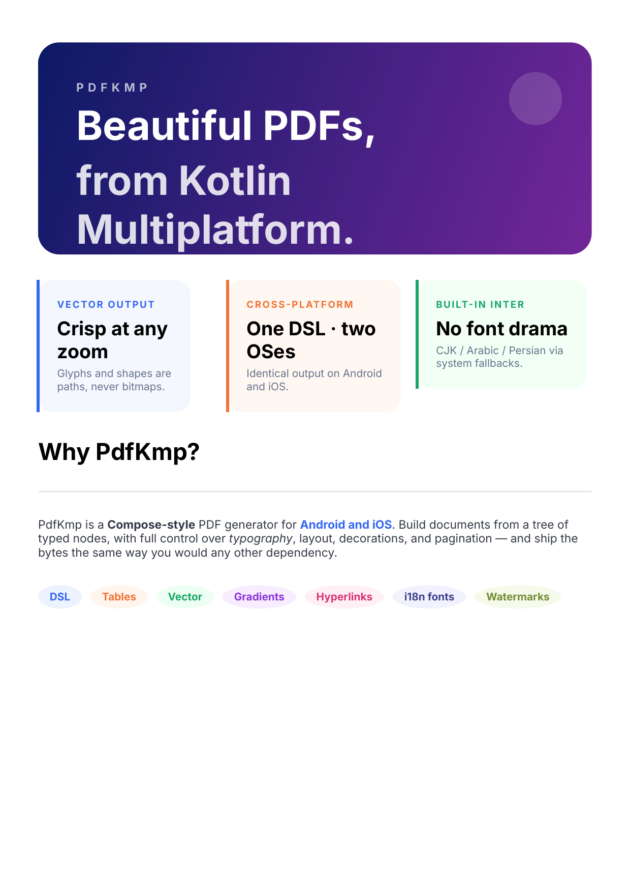
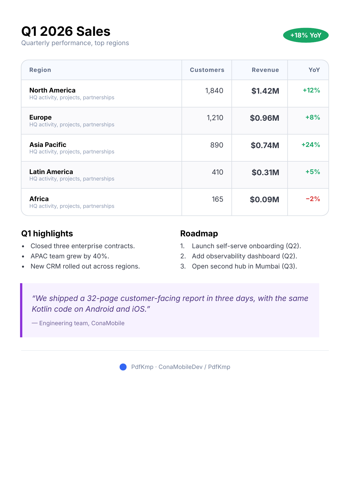

# PdfKmp

[](https://central.sonatype.com/artifact/io.github.conamobiledev/pdfkmp)
[](https://www.apache.org/licenses/LICENSE-2.0)
[](https://kotlinlang.org)
[](#installation)

> Kotlin Multiplatform PDF generator for Android and iOS — vector-first, type-safe, DSL-driven.

<table align="center">
  <tr>
    <td align="center"><strong>Android</strong></td>
    <td align="center"><strong>iOS</strong></td>
  </tr>
  <tr>
    <td></td>
    <td></td>
  </tr>
</table>

<p align="center">
  <em>The same <code>Samples.brochure()</code> document rendered on Android and iOS — pixel-identical vector output. Try it: <code>Samples.brochure().toByteArray()</code>.</em>
</p>

PdfKmp lets you build PDF documents from a Compose-style DSL that runs identically on Android and iOS. Text becomes glyph paths, shapes become path operators — every page stays sharp at any zoom level. The library ships the **Inter** font for cross-platform Latin parity and exposes opt-in references to system CJK / Arabic / Persian fonts so non-Latin scripts render natively.

**Under the hood — native PDF stacks, no third-party engines:**

| Platform | Backend |
|---|---|
| Android | [`android.graphics.pdf.PdfDocument`](https://developer.android.com/reference/android/graphics/pdf/PdfDocument) + `android.graphics.Canvas` |
| iOS | [`UIGraphicsBeginPDFContextToData`](https://developer.apple.com/documentation/uikit/uigraphicsbeginpdfcontexttodata) + Core Graphics (`CGContext`) |

Every DSL node funnels into these system PDF APIs, so the resulting bytes are real, native, vector PDFs — readable in Preview, Adobe Reader, Chrome, and any spec-compliant viewer.

---

## Table of contents

- [Installation](#installation)
  - [Optional — Compose Multiplatform Resources integration](#optional--compose-multiplatform-resources-integration)
  - [R8 / ProGuard](#r8--proguard)
- [Hello world](#hello-world)
- [Document & pages](#document--pages)
- [Text](#text)
- [Rich text (multi-style spans)](#rich-text-multi-style-spans)
- [Layout — column / row / box / weighted](#layout--column--row--box--weighted)
- [Decorations — backgrounds, corners, borders, gradients](#decorations--backgrounds-corners-borders-gradients)
- [Dividers, lines and shapes](#dividers-lines-and-shapes)
- [Lists](#lists)
- [Tables](#tables)
- [Images](#images)
- [Vector / SVG](#vector--svg)
- [Header, footer, page numbers, watermark](#header-footer-page-numbers-watermark)
- [Hyperlinks](#hyperlinks)
- [i18n fonts (CJK / Arabic / Persian) and custom fonts](#i18n-fonts-cjk--arabic--persian-and-custom-fonts)
- [Compose Multiplatform Resources](#compose-multiplatform-resources)
- [Saving the document](#saving-the-document)
- [What to do after save — view, share, open](#what-to-do-after-save--view-share-open)
- [Page break strategies](#page-break-strategies)
- [Bundled samples](#bundled-samples)
- [Sample apps](#sample-apps)
- [Contributing](#contributing)
- [License](#license)

---

## Installation

PdfKmp is published to **Maven Central**. The library exposes:
- an Android `aar` (`io.github.conamobiledev:pdfkmp-android`),
- an iOS framework named `PdfKmp` for arm64, x64, and simulator-arm64,
- common Kotlin metadata (`io.github.conamobiledev:pdfkmp`).

### Kotlin Multiplatform project

```kotlin
// settings.gradle.kts
dependencyResolutionManagement {
    repositories {
        mavenCentral()
    }
}
```

```kotlin
// build.gradle.kts
kotlin {
    sourceSets {
        commonMain.dependencies {
            implementation("io.github.conamobiledev:pdfkmp:0.2.0-alpha01")
        }
    }
}
```

### Android-only project

```kotlin
// app/build.gradle.kts
dependencies {
    implementation("io.github.conamobiledev:pdfkmp-android:0.2.0-alpha01")
}
```

### Optional — Compose Multiplatform Resources integration

If your project already uses Compose Multiplatform Resources (`Res.drawable.*`), add the companion module so you can drop typed resource references straight into the PdfKmp DSL. Skip this dependency entirely if you don't use Compose Resources — the core artifact above stays Compose-free.

```kotlin
// build.gradle.kts (add next to the core artifact)
implementation("io.github.conamobiledev:pdfkmp-compose-resources:0.2.0-alpha01")
```

Full usage in the [Compose Multiplatform Resources](#compose-multiplatform-resources) section below.

### Requirements

- JDK 17+
- Android Gradle Plugin 8.x, `compileSdk` 34+
- Xcode 16+ when targeting iOS via Kotlin Multiplatform

### R8 / ProGuard

R8 is fully supported — no additional keep rules required.

---

## Hello world

```kotlin
import com.conamobile.pdfkmp.pdf
import com.conamobile.pdfkmp.storage.StorageLocation
import com.conamobile.pdfkmp.storage.save
import com.conamobile.pdfkmp.style.PdfColor
import com.conamobile.pdfkmp.unit.sp

// 1. Build the document
//    Use `pdf { }` for a synchronous build, or `pdfAsync { }` (suspend) when
//    the tree contains typed `Res.drawable.*` references — see Compose
//    Multiplatform Resources below.
val document = pdf {
    metadata { title = "Hello, PdfKmp" }
    page {
        text("Hello, world!") {
            fontSize = 24.sp
            bold = true
            color = PdfColor.Blue
        }
    }
}

// 2. Pick what to do with it:
val bytes: ByteArray = document.toByteArray()              // raw bytes
// or
val saved = document.save(StorageLocation.Cache, "hello.pdf")  // suspend, returns SavedPdf
println(saved.path)  // absolute filesystem path you can hand to a viewer / share intent
```

After `save(...)` you get a [`SavedPdf`](#saving-the-document) with a real filesystem path. The next sections walk through every feature; jump to **[What to do after save — view, share, open](#what-to-do-after-save--view-share-open)** for ready-made snippets that hand the file to a PDF viewer or share sheet.

---

## Document & pages

Every document opens with `pdf { ... }`. Inside, configure metadata, document-wide defaults, and add one or more pages:

```kotlin
pdf {
    metadata {
        title = "Quarterly Report"
        author = "PdfKmp"
        subject = "Sales summary for Q1"
        keywords = listOf("sales", "q1", "report")
    }

    // Defaults inherited by every page until overridden inside the page block.
    defaultTextStyle = TextStyle(fontSize = 12.sp, color = PdfColor.DarkGray)
    defaultPagePadding = Padding.symmetric(horizontal = 40.dp, vertical = 56.dp)
    defaultPageBreakStrategy = PageBreakStrategy.MoveToNextPage

    page(size = PageSize.A4) {
        spacing = 12.dp
        text("First page")
    }

    page(size = PageSize.Letter) {
        padding = Padding.all(20.dp) // override default for this page
        text("Second page — Letter format")
    }
}
```

Available page sizes include `PageSize.A4`, `PageSize.A5`, `PageSize.Letter`, `PageSize.Legal`, plus `PageSize.custom(widthPt, heightPt)`. Use `Padding.all`, `Padding.symmetric`, or pass each side explicitly.

---

## Text

Text takes a string plus an optional configuration block. Every property starts at the inherited `textStyle` and can be overridden:

```kotlin
text("Heading") {
    fontSize = 28.sp
    fontWeight = FontWeight.Bold      // or `bold = true`
    fontStyle = FontStyle.Italic      // or `italic = true`
    color = PdfColor.Black
    letterSpacing = 1.5.sp
    lineHeight = 32.sp                // 0 keeps the font's natural value
    underline = true
    strikethrough = false
    align = TextAlign.Center          // Start / Center / End / Justify
    font = PdfFont.Default            // Inter (bundled)
}
```

Color helpers (more in [`PdfColor.kt`](pdfkmp/src/commonMain/kotlin/com/conamobile/pdfkmp/style/PdfColor.kt)):

```kotlin
PdfColor.Red / Green / Blue / Black / White / Gray / LightGray / DarkGray
PdfColor(r, g, b, a)                       // floats in 0..1
PdfColor.fromRgb(0xFF5722)                 // hex literal as Long
PdfColor.fromHex("#FF5722")                // hex string — RGB / RRGGBB / AARRGGBB
PdfColor.Blue.withAlpha(0.2f)              // copy with new opacity
```

---

## Rich text (multi-style spans)

When a single paragraph mixes weights, colors, or decorations and must wrap as one block of prose, use `richText { ... }`:

```kotlin
richText {
    span("This sentence has a ")
    span("highlighted") { color = PdfColor.Red; bold = true }
    span(" word and an ")
    span("italic phrase") { italic = true }
    span(" inside it.")
}
```

The wrapper packs every span into one paragraph, wraps lines at the parent's width, and respects per-span styling end-to-end.

---

## Layout — column / row / box / weighted

PdfKmp uses Compose-flavoured layout primitives.

### Column (vertical stack)

```kotlin
column(
    spacing = 8.dp,
    verticalArrangement = VerticalArrangement.Top,           // Top / Center / Bottom / SpaceBetween / ...
    horizontalAlignment = HorizontalAlignment.Start,         // Start / Center / End
) {
    text("First")
    text("Second")
    text("Third")
}
```

### Row (horizontal stack)

```kotlin
row(
    spacing = 12.dp,
    horizontalArrangement = HorizontalArrangement.SpaceBetween,
    verticalAlignment = VerticalAlignment.Center,
) {
    text("Left")
    text("Right")
}
```

### Box (Z-stack)

Layered children — first added is at the bottom, last on top.

```kotlin
box(width = 400.dp, height = 200.dp, cornerRadius = 12.dp) {
    image(bytes = heroBytes, contentScale = ContentScale.Crop)
    aligned(BoxAlignment.BottomStart) {
        text("Hero title") { color = PdfColor.White; fontSize = 28.sp }
    }
}
```

### Weighted children

Inside a `row` or `column`, `weighted(n)` claims a fractional share of the leftover space along the main axis:

```kotlin
row(spacing = 12.dp) {
    weighted(1f) { text("33%") }
    weighted(2f) { text("66%") }
}
```

### Spacer

Explicit gap when the container's `spacing` isn't enough:

```kotlin
spacer(height = 24.dp)
```

---

## Decorations — backgrounds, corners, borders, gradients

Every container (`column`, `row`, `box`, `card`) accepts the same decoration vocabulary.

### Solid background + uniform border + rounded corners

```kotlin
card(
    background = PdfColor.White,
    cornerRadius = 12.dp,
    padding = Padding.all(16.dp),
    border = BorderStroke(1.dp, PdfColor.LightGray),
) {
    text("Material-style card")
}
```

`card { ... }` is shorthand for a decorated `column`.

### Per-corner radius

When corners differ — tabs, asymmetric tiles — pass `cornerRadiusEach`:

```kotlin
box(
    width = 240.dp,
    height = 60.dp,
    background = PdfColor.Blue,
    cornerRadiusEach = CornerRadius.top(16.dp), // top-only rounded; bottom flat
) { aligned(BoxAlignment.Center) { text("Active tab") { color = PdfColor.White } } }

// Fully asymmetric:
cornerRadiusEach = CornerRadius(
    topLeft = 24.dp, topRight = 4.dp,
    bottomLeft = 4.dp, bottomRight = 24.dp,
)
```

### Per-side border

Outline only the sides you want — Material-style accent quotes, progress steppers:

```kotlin
card(
    cornerRadius = 0.dp,
    padding = Padding.all(12.dp),
    borderEach = BorderSides(
        bottom = BorderStroke(2.dp, PdfColor.Blue),
        left = BorderStroke(2.dp, PdfColor.Blue),
    ),
) {
    text("Accent quote — bottom + left only")
}
```

### Gradient backgrounds

Pass a `PdfPaint` (linear or radial) via `backgroundPaint`. Coordinates are local to the container — `(0, 0)` is its top-left:

```kotlin
box(
    width = 480.dp, height = 80.dp, cornerRadius = 12.dp,
    backgroundPaint = PdfPaint.linearGradient(
        from = PdfColor.Blue, to = PdfColor.Red,
        endX = 480f, endY = 0f,
    ),
) {
    aligned(BoxAlignment.Center) {
        text("Sunrise banner") { color = PdfColor.White; bold = true }
    }
}

// Radial:
backgroundPaint = PdfPaint.radialGradient(
    from = PdfColor.White, to = PdfColor(0.1f, 0.1f, 0.4f),
    centerX = 240f, centerY = 60f, radius = 240f,
)

// Multi-stop:
backgroundPaint = PdfPaint.LinearGradient(
    startX = 0f, startY = 0f, endX = 480f, endY = 0f,
    stops = listOf(
        GradientStop(0.00f, PdfColor.Red),
        GradientStop(0.33f, PdfColor.Green),
        GradientStop(0.66f, PdfColor.Blue),
        GradientStop(1.00f, PdfColor.Red),
    ),
)
```

### Clip overflowing children

Containers with a non-zero `cornerRadius` already clip children to the rounded shape. For square-cornered fixed-size containers (e.g. `box(width = 200.dp, height = 80.dp)`), pass `clipToBounds = true` to make sure overflowing children don't paint past the rectangle:

```kotlin
box(
    width = 200.dp,
    height = 80.dp,
    background = PdfColor.LightGray,
    clipToBounds = true,    // sharp-rect clip; default is false
) {
    text(longText)          // anything past 80dp tall gets clipped
}
```

Available on `column`, `row`, `box`, and `card`.

---

## Dividers, lines and shapes

### Divider

A thin horizontal rule that spans the parent's width:

```kotlin
divider(thickness = 0.5.dp, color = PdfColor.Gray)                       // solid
divider(thickness = 1.dp,   color = PdfColor.Gray, style = LineStyle.Dashed)
divider(thickness = 1.5.dp, color = PdfColor.Red,  style = LineStyle.Dotted)
```

### Circle / Ellipse

Vector circles and ellipses with solid fills, gradient paints, or stroke-only outlines:

```kotlin
circle(diameter = 60.dp, fill = PdfColor.Red)
circle(
    diameter = 80.dp,
    fillPaint = PdfPaint.radialGradient(
        from = PdfColor.White, to = PdfColor.Blue,
        centerX = 40f, centerY = 40f, radius = 40f,
    ),
)
ellipse(width = 100.dp, height = 60.dp, fill = PdfColor.Green)
circle(diameter = 60.dp, strokeColor = PdfColor.Black, strokeWidth = 2.dp)
```

---

## Lists

```kotlin
bulletList(
    items = listOf(
        "First item.",
        "Wrapped continuation lines line up under the first text line, not under the bullet.",
        "Third item.",
    ),
)

bulletList(items = listOf("Step", "Skip", "Stomp"), bullet = "→")

numberedList(
    items = listOf("Author", "Render", "Ship"),
    startAt = 1,
)
```

---

## Tables

```kotlin
table(
    columns = listOf(
        TableColumn.Fixed(70.dp),     // fixed width
        TableColumn.Weight(2f),       // share of remaining
        TableColumn.Weight(1f),
    ),
    border = TableBorder(color = PdfColor.fromRgb(0xCFD8DC), width = 1.dp),
    cornerRadius = 10.dp,
    cellPadding = Padding.symmetric(horizontal = 12.dp, vertical = 10.dp),
) {
    header(background = PdfColor.fromRgb(0xECEFF1)) {
        cell("ID")
        cell("Customer")
        cell("Status", horizontalAlignment = HorizontalAlignment.End)
    }

    users.forEachIndexed { i, user ->
        val zebra = if (i % 2 == 0) PdfColor.White else PdfColor.fromRgb(0xF7F9FA)
        row(background = zebra) {
            cell(user.id) { color = PdfColor.Gray }
            cell {
                text(user.name) { bold = true }
                text(user.email) { fontSize = 10.sp; color = PdfColor.Gray }
            }
            cell(
                value = user.status,
                horizontalAlignment = HorizontalAlignment.End,
                verticalAlignment = VerticalAlignment.Center,
            )
        }
    }
}
```

Cells can wrap arbitrary node trees — stack a title + subtitle, embed an icon, etc. Border configuration: `TableBorder.None`, or set `showOutline / showHorizontalLines / showVerticalLines` independently.

---

## Images

PNG and JPEG are decoded everywhere; WebP / HEIF where the platform supports them.

```kotlin
image(bytes = imageBytes, width = 300.dp, contentScale = ContentScale.Fit)

// Square crop:
image(
    bytes = imageBytes,
    width = 200.dp,
    height = 200.dp,
    contentScale = ContentScale.Crop,
)

// Width given, height derived from intrinsic aspect ratio:
image(bytes = imageBytes, width = 480.dp)

// Intrinsic pixel size (1px → 1pt):
image(bytes = imageBytes)
```

`ContentScale.FillBounds` stretches to the destination box.

> **Compose Multiplatform Resources users** — pass a typed `Res.drawable.*` reference straight in via `image(Res.drawable.cover_photo, width = 480.dp)` from the [`pdfkmp-compose-resources`](#compose-multiplatform-resources) module. The DSL stays sync; bytes are read during `pdfAsync`'s preflight pass.

---

## Vector / SVG

Both Android `<vector>` XML and W3C `<svg>` are accepted by `VectorImage.parse(...)`. Vectors stay vector inside the PDF — no rasterisation, sharp at any zoom.

```kotlin
val star = VectorImage.parse(starXml) // parse once, reuse many times

vector(image = star, width = 64.dp)
vector(image = star, width = 64.dp, tint = PdfColor.Red)              // override fill
vector(image = star, width = 64.dp, strokeMode = VectorStrokeMode.Disabled)

// Inline parsing for one-offs:
vector(xml = """<svg ...>...</svg>""", width = 48.dp)
```

Supported features include solid fills, linear and radial gradients, elliptical arcs (`A`/`a` SVG path commands), and `<g transform="translate/rotate/scale">` group transforms.

> **Compose Multiplatform Resources users** — skip the manual `VectorImage.parse(...)` and pass a typed `Res.drawable.*` reference directly: `vector(Res.drawable.logo, width = 64.dp, tint = PdfColor.Blue)`. See the [Compose Multiplatform Resources](#compose-multiplatform-resources) section for the full integration.

---

## Header, footer, page numbers, watermark

Every logical page can declare a header, footer, and watermark. Headers and footers receive a `PageContext` carrying the current page number and the total page count — accurate even when content slices across multiple physical pages, because the renderer does a counting dry-run before the real pass.

```kotlin
page {
    pageBreakStrategy = PageBreakStrategy.Slice

    header { ctx ->
        row(horizontalArrangement = HorizontalArrangement.SpaceBetween) {
            text("Quarterly Report") { bold = true; fontSize = 12.sp }
            text("Page ${ctx.pageNumber} of ${ctx.totalPages}") {
                fontSize = 11.sp; color = PdfColor.Gray
            }
        }
        divider(thickness = 0.5.dp, color = PdfColor.LightGray)
    }

    footer { ctx ->
        divider(thickness = 0.5.dp, color = PdfColor.LightGray, style = LineStyle.Dashed)
        text("conamobile · pdfkmp") {
            fontSize = 10.sp; color = PdfColor.Gray; align = TextAlign.Center
        }
    }

    watermark {
        aligned(BoxAlignment.Center) {
            text("DRAFT") {
                fontSize = 120.sp; bold = true
                color = PdfColor(0.92f, 0.92f, 0.95f)
            }
        }
    }

    // … body content
}
```

Header is rendered inside the top page padding band, footer inside the bottom padding band, watermark behind the body content of every physical page.

---

## Hyperlinks

`link(url) { … }` wraps any content in a clickable region:

```kotlin
link(url = "https://github.com/conamobiledev/PdfKmp") {
    text("github.com/conamobiledev/PdfKmp") {
        color = PdfColor.Blue; underline = true
    }
}

link(url = "mailto:hello@example.com") {
    text("hello@example.com") { color = PdfColor.Blue; underline = true }
}

// Whole card clickable:
link(url = "https://example.com") {
    card(border = BorderStroke(1.dp, PdfColor.Blue)) {
        text("Visit site →") { color = PdfColor.Blue; bold = true }
    }
}
```

On iOS the rectangles produce real PDF link annotations via `UIGraphicsSetPDFContextURLForRect`. Android's `PdfDocument` does not expose annotation APIs in v1, so on Android the visual styling stands in for the click target — the rectangle is recorded but readers cannot dispatch clicks. Both behaviours are intentional and the iOS output works in any reader (Preview, Adobe Reader, Chrome's PDF viewer).

---

## i18n fonts (CJK / Arabic / Persian) and custom fonts

PdfKmp ships **Inter** for Latin text. For non-Latin scripts, use the cross-platform `PdfFont.System*` references — each one is a comma-separated candidate chain that resolves to whichever font the running platform has installed:

```kotlin
text("漢字、ひらがな、カタカナ — 中文 / 日本語 / 한국어") {
    font = PdfFont.SystemCJK         // → "Noto Sans CJK SC, PingFang SC"
}

text("مرحبًا بكم في PdfKmp") {
    font = PdfFont.SystemArabic      // → "Noto Sans Arabic, Geeza Pro"
}

text("سلام دنیا") {
    font = PdfFont.SystemPersian     // → "Noto Naskh Arabic, Tahoma, Geeza Pro"
}
```

If a platform is missing every candidate the renderer falls back to Inter, which lacks those glyphs. Register a `.ttf` / `.otf` to guarantee coverage:

```kotlin
val notoCjk = PdfFont.Custom(name = "NotoSansCJK", bytes = readFromAssets("NotoSansCJK.ttf"))

pdf {
    registerFont(notoCjk)
    page {
        text("永和九年") { font = notoCjk }
    }
}
```

Custom fonts referenced anywhere in the document are picked up automatically — `registerFont` is only needed for fonts that no current node references but should still be embedded.

---

## Compose Multiplatform Resources

The optional `pdfkmp-compose-resources` module wires Compose Multiplatform's typed `Res.drawable.*` accessors into the PdfKmp DSL. You point at a resource by reference — no string paths, no manual byte decoding, no `VectorImage.parse(...)` boilerplate, no `runBlocking`. The companion `pdfAsync { ... }` builder runs a one-shot suspend preflight before layout; inside the block the DSL stays fully synchronous and reads exactly like the eager `pdf { ... }` API.

### Install

```kotlin
// build.gradle.kts
kotlin {
    sourceSets {
        commonMain.dependencies {
            implementation("io.github.conamobiledev:pdfkmp:0.2.0-alpha01")
            implementation("io.github.conamobiledev:pdfkmp-compose-resources:0.2.0-alpha01")
        }
    }
}
```

Pulls in `org.jetbrains.compose.components:components-resources` transitively. The core `:pdfkmp` artifact stays Compose-free — non-Compose consumers don't pay for it.

### Inline DSL — `pdfAsync` + typed `Res.drawable.*`

Place a typed `Res.drawable.*` reference exactly where you would normally call `vector(image = …)` or `image(bytes = …)`. The library auto-detects vector XML vs raster bytes from the file's leading magic bytes and dispatches to the correct rendering path:

```kotlin
import com.conamobile.pdfkmp.composeresources.drawable
import com.conamobile.pdfkmp.composeresources.image
import com.conamobile.pdfkmp.composeresources.vector
import com.conamobile.pdfkmp.pdfAsync
import myapp.generated.resources.Res
import myapp.generated.resources.logo
import myapp.generated.resources.cover_photo

// `suspend` because pdfAsync awaits the resource preflight pass.
// The DSL block itself — page { ... }, row { ... } — stays synchronous.
suspend fun buildReport(): PdfDocument = pdfAsync {
    metadata { title = "Quarterly Report" }
    page {
        // `drawable` accepts both vector XML and raster bytes.
        // Auto-detect happens at preflight, before layout.
        drawable(Res.drawable.logo, width = 64.dp, tint = PdfColor.Blue)
        drawable(Res.drawable.cover_photo, width = 480.dp)

        // Or be explicit when the format is known up front:
        vector(Res.drawable.logo, width = 24.dp, tint = PdfColor.Blue)
        image(Res.drawable.cover_photo, width = 480.dp, contentScale = ContentScale.Fit)
    }
}
```

### `pdf { }` vs `pdfAsync { }`

`pdfAsync` is `pdf` with a one-shot suspend preflight pass tacked onto the front. The DSL inside is **identical** — every container scope (`page`, `column`, `row`, `box`, `card`, `table`, `richText`, `link`, …) has the same shape and same options. Only the top-level entry differs:

| | `pdf { }` | `pdfAsync { }` |
|---|---|---|
| Function shape | non-suspend | `suspend` |
| `drawable / vector / image (Res.drawable.X)` | throws at render time | works |
| All other DSL features | identical | identical |
| When to reach for it | document is built from in-memory bytes or pre-parsed `VectorImage`s | the tree contains one or more `Res.drawable.*` references |

`pdf { }` is preserved verbatim — existing code keeps working with zero changes. Reach for `pdfAsync` only when you actually want the typed-resource overloads.

> **Limitation.** Headers, footers, and watermarks are invoked per physical page during the render pass, after the preflight is over. They cannot hold deferred resource references — load anything async-loaded in the page body, or pre-resolve outside the DSL and pass the parsed result into the header / footer factory.

For preloading or custom caching outside the DSL, every `DrawableResource` exposes three suspend extensions — `toVectorImage()`, `toBytes()`, `toPdfDrawable()` — IDE auto-complete will surface them with full KDoc.

---

## Saving the document

PdfKmp gives you three ways to handle the generated PDF, in order of convenience:

### 1. `save(...)` — typed multiplatform locations (recommended)

```kotlin
import com.conamobile.pdfkmp.storage.StorageLocation
import com.conamobile.pdfkmp.storage.save

val doc = pdf { /* ... */ }

val saved = doc.save(StorageLocation.Cache, filename = "report.pdf")
println(saved.path)     // absolute filesystem path
println(saved.name)     // "report.pdf"
println(saved.location) // StorageLocation.Cache
```

`save` is a `suspend fun` — call it from a coroutine on Android, an `async` on iOS, or wrap it in `runBlocking` for one-shot scripts. It returns a `SavedPdf` with three fields:

| Field | Type | Description |
|---|---|---|
| `path` | `String` | Absolute path to the file on disk. Use this for `File(path)` / `URL(fileURLWithPath:)`. |
| `name` | `String` | The filename you supplied (e.g. `"report.pdf"`). |
| `location` | `StorageLocation` | The location you saved to — useful when the same code branches by destination. |

### 2. `toByteArray()` — raw PDF bytes

```kotlin
val bytes: ByteArray = doc.toByteArray()
// upload over the network, attach to an email, post to S3, …
```

### 3. iOS-only `toNSData()` — bridge to UIKit

```kotlin
// Inside iosMain:
import com.conamobile.pdfkmp.toNSData

val data: NSData = doc.toNSData()
// hand off to UIDocumentInteractionController, PDFDocument(data:), etc.
```

### Available storage locations

| Location | Android | iOS | Use case |
|---|---|---|---|
| `Cache` | app-internal cache | `Caches/` | temporary preview, can be cleaned by the OS |
| `AppFiles` | app-internal files | `Library/` | persistent, app-private |
| `AppExternalFiles` | scoped external (no permission) | falls back to `Documents/` | larger files, app-scoped |
| `Downloads` | shared `Downloads/` via MediaStore | shared Files app `Downloads/` | user can find it from system file manager |
| `Documents` | shared `Documents/` | iCloud `Documents/` | user-visible documents |
| `Temp` | `cacheDir/tmp/` | `tmp/` | one-shot temp file you'll delete after sharing |
| `Custom("/abs/path/dir")` | any writable directory | any writable directory | full control |

> **Android storage permissions:** `Cache`, `AppFiles`, `AppExternalFiles`, and `Temp` need **no permission** on any Android version. `Downloads` / `Documents` use the system MediaStore on Android 10+ which also needs no permission. For `Custom` paths outside your app sandbox, you supply your own permissions / Storage Access Framework handling.

> **iOS sandboxing:** Every `StorageLocation` resolves inside your app's sandbox; iCloud `Documents` requires the `iCloud Documents` capability in your Xcode project.

---

## What to do after save — view, share, open

Most apps don't stop at "I have a file on disk" — you want to **show the PDF** to the user, **share it** to another app, or **let them email it**. Here's what each platform needs.

### Android — display the PDF in your app

Android's system `PdfRenderer` rasterises a page to a `Bitmap`:

```kotlin
import android.graphics.Bitmap
import android.graphics.pdf.PdfRenderer
import android.os.ParcelFileDescriptor
import androidx.compose.foundation.Image
import androidx.compose.runtime.*
import androidx.compose.ui.graphics.asImageBitmap
import java.io.File

@Composable
fun PdfPagePreview(saved: SavedPdf, pageIndex: Int = 0) {
    val bitmap by produceState<Bitmap?>(null, saved.path, pageIndex) {
        val pfd = ParcelFileDescriptor.open(File(saved.path), ParcelFileDescriptor.MODE_READ_ONLY)
        PdfRenderer(pfd).use { renderer ->
            renderer.openPage(pageIndex).use { page ->
                val bmp = Bitmap.createBitmap(page.width * 2, page.height * 2, Bitmap.Config.ARGB_8888)
                bmp.eraseColor(android.graphics.Color.WHITE)
                page.render(bmp, null, null, PdfRenderer.Page.RENDER_MODE_FOR_DISPLAY)
                value = bmp
            }
        }
    }
    bitmap?.let { Image(bitmap = it.asImageBitmap(), contentDescription = null) }
}
```

The `:sample` Android app does exactly this — see `SampleActivity.kt`.

### Android — share or open in an external PDF viewer

Public PDF viewers (Adobe Reader, Drive, etc.) need a `content://` URI, not a file path. Use a `FileProvider`:

```xml
<!-- AndroidManifest.xml -->
<provider
    android:name="androidx.core.content.FileProvider"
    android:authorities="${applicationId}.pdfprovider"
    android:exported="false"
    android:grantUriPermissions="true">
    <meta-data
        android:name="android.support.FILE_PROVIDER_PATHS"
        android:resource="@xml/file_paths" />
</provider>
```

```xml
<!-- res/xml/file_paths.xml -->
<paths>
    <cache-path name="cache_pdfs" path="." />
    <files-path name="internal_pdfs" path="." />
    <external-files-path name="external_pdfs" path="." />
</paths>
```

```kotlin
import android.content.Intent
import androidx.core.content.FileProvider
import java.io.File

fun sharePdf(context: Context, saved: SavedPdf) {
    val file = File(saved.path)
    val uri = FileProvider.getUriForFile(
        context,
        "${context.packageName}.pdfprovider",
        file,
    )
    val intent = Intent(Intent.ACTION_SEND).apply {
        type = "application/pdf"
        putExtra(Intent.EXTRA_STREAM, uri)
        addFlags(Intent.FLAG_GRANT_READ_URI_PERMISSION)
    }
    context.startActivity(Intent.createChooser(intent, "Share PDF"))
}

// "Open with" — let user pick any installed PDF viewer:
fun openInPdfViewer(context: Context, saved: SavedPdf) {
    val uri = FileProvider.getUriForFile(
        context,
        "${context.packageName}.pdfprovider",
        File(saved.path),
    )
    val intent = Intent(Intent.ACTION_VIEW).apply {
        setDataAndType(uri, "application/pdf")
        addFlags(Intent.FLAG_GRANT_READ_URI_PERMISSION)
    }
    context.startActivity(intent)
}
```

### iOS — display the PDF in your app

`PDFKit.PDFView` displays the document as **vector** — zoom is unlimited, glyphs stay sharp. From SwiftUI:

```swift
import PDFKit
import SwiftUI
import PdfKmp   // The Kotlin framework

struct PdfPreviewView: View {
    let savedPath: String
    @State private var document: PDFDocument?

    var body: some View {
        Group {
            if let document = document {
                PdfPreview(document: document)
            } else {
                ProgressView("Rendering…")
            }
        }
        .onAppear {
            document = PDFDocument(url: URL(fileURLWithPath: savedPath))
        }
    }
}

struct PdfPreview: UIViewRepresentable {
    let document: PDFDocument
    func makeUIView(context: Context) -> PDFView {
        let view = PDFView()
        view.autoScales = true
        view.displayMode = .singlePageContinuous
        view.displayDirection = .vertical
        return view
    }
    func updateUIView(_ uiView: PDFView, context: Context) {
        uiView.document = document
    }
}
```

Pass the path you got from `save(...).path` (Kotlin) — Swift code reads it via interop and turns it into a `URL`.

### iOS — share via UIActivityViewController

```swift
import UIKit

func sharePdf(savedPath: String, presenter: UIViewController) {
    let url = URL(fileURLWithPath: savedPath)
    let activity = UIActivityViewController(
        activityItems: [url],
        applicationActivities: nil,
    )
    presenter.present(activity, animated: true)
}
```

This brings up the standard share sheet — AirDrop, Messages, Mail, "Save to Files", any installed PDF viewer.

> On Compose Multiplatform, wrap the two snippets above in an `expect` / `actual` `@Composable PdfViewer(saved: SavedPdf)` — `AndroidView { PdfRenderer(...) }` on `androidMain`, `UIKitView { PDFView() }` on `iosMain`. A first-class `PdfViewer` component is on the `0.2.0` roadmap.

---

## Page break strategies

Long content overflows pages naturally. Two strategies control the split:

```kotlin
page {
    pageBreakStrategy = PageBreakStrategy.MoveToNextPage  // default
    // Whole element moves to a new page if it would not fit.
}

page {
    pageBreakStrategy = PageBreakStrategy.Slice
    // Text splits at line boundaries; tall images cut at the page edge
    // and continue seamlessly on the next page.
}
```

Set the document-wide default via `defaultPageBreakStrategy`, override per page on `PageScope.pageBreakStrategy`.

---

## Bundled samples

[`Samples.kt`](pdfkmp/src/commonMain/kotlin/com/conamobile/pdfkmp/samples/Samples.kt) ships ready-to-render demo documents you can call straight from any consumer — handy as smoke tests, copy-paste starting points, or fixtures for golden-file comparisons. Every entry returns a `PdfDocument`; pipe it through `.toByteArray()` or `.save(...)` and you have a real PDF in seconds.

| Function | What it shows |
|---|---|
| `Samples.brochure()` | The hero document at the top of this README — multi-page marketing layout |
| `Samples.helloWorld()` | Minimal one-page document |
| `Samples.typography()` | Text styling + decorations + alignment + `richText` spans |
| `Samples.rowAndColumn()` | Layout primitives with `weighted` children |
| `Samples.columnSpaceBetween()` | Column with `VerticalArrangement.SpaceBetween` |
| `Samples.tableShowcase()` | Tables, bullet lists, numbered lists |
| `Samples.vectorShowcase()` | Vector / SVG icons + circles + ellipses |
| `Samples.vectorAdvanced()` | Gradient fills, elliptical arcs, group transforms |
| `Samples.customDesigns(imageBytes)` | Cards with gradients, corner radii, per-side borders |
| `Samples.pageChrome()` | Header, footer, page numbers, watermark, hyperlinks, i18n fonts |
| `Samples.longBody()` | Page break strategy `MoveToNextPage` |
| `Samples.slicedBody()` | Page break strategy `Slice` |
| `Samples.customPadding()` | Per-page padding override |
| `Samples.withImage(imageBytes)` | Raster image with `ContentScale.Fit` + `.Crop` |
| `Samples.slicedImage(imageBytes)` | Tall image sliced across multiple physical pages |
| `Samples.showcase()` | Every v1 feature in a single PDF |

Three samples (`withImage`, `slicedImage`, `customDesigns`) take a `ByteArray` so the demo media stays in the consumer app's assets rather than the library jar — see `:sample/src/androidMain/assets/sample.png` for the bytes used by the bundled apps.

---

## Sample apps

The repo ships two sample apps that mirror each other feature-for-feature:

- `:sample` — Compose Android app, structured as a single-target KMP module (`androidTarget()` only) so it can pull resources from `commonMain/composeResources/` for the `pdfAsync { drawable(Res.drawable.X) }` showcase. Run with `./gradlew :sample:installDebug`.
- `iosApp/iosApp.xcodeproj` — SwiftUI iOS app. Open in Xcode and Run; the build phase calls `:pdfkmp:embedAndSignAppleFrameworkForXcode` automatically.

Both apps surface every demo from `Samples` (in `:pdfkmp/src/commonMain/kotlin/.../samples/Samples.kt`) plus `ComposeResourcesDemo` (Android sample only — iOS demo coming with the next iOS sample refresh) so you can eyeball each feature on real devices.

---

## Contributing

Bug reports, feature requests and pull requests are all welcome — open an issue at <https://github.com/ConaMobileDev/PdfKmp/issues> or send a PR.

When working on the library locally:

```bash
# Run the full test suite (canonical surface — exercises every backend on iOS Simulator)
./gradlew :pdfkmp:iosSimulatorArm64Test

# Build all platform artefacts
./gradlew :pdfkmp:assemble

# Install the Android sample on a connected device
./gradlew :sample:installDebug
```

For repo conventions and AI-agent guidance see [CLAUDE.md](CLAUDE.md) (working **on** this codebase) and [AGENTS.md](AGENTS.md) / `.claude/skills/pdfkmp/SKILL.md` (using the library).

---

## Powered by Claude

This library — the public API, the layout engine, the Android and iOS rendering backends, every test, the sample apps, and this README — was authored end-to-end with [Claude Code](https://claude.com/claude-code), Anthropic's coding agent. Bug reports, suggestions, and PRs welcome.

---

## License

Apache License 2.0 — see [LICENSE](LICENSE).

The bundled Inter font is licensed separately under the SIL Open Font License 1.1 — see `pdfkmp/fonts/Inter-LICENSE.txt`.
