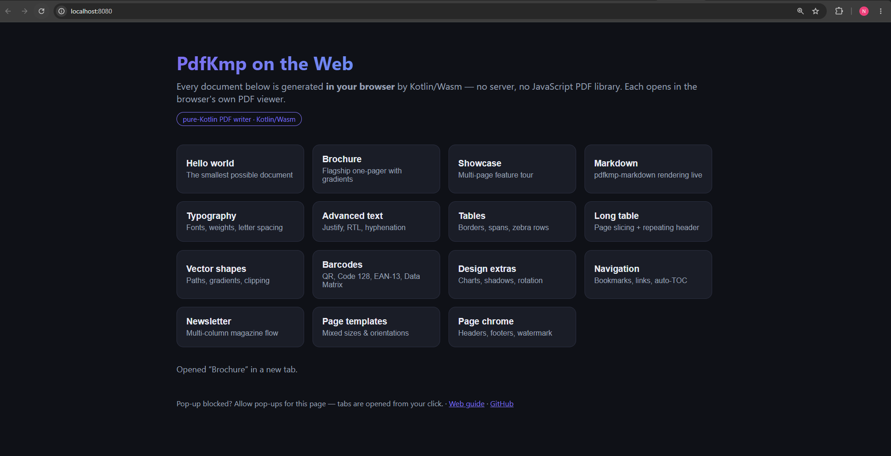

# PdfKmp

[](https://central.sonatype.com/artifact/io.github.conamobiledev/pdfkmp)
[](https://www.apache.org/licenses/LICENSE-2.0)
[](https://kotlinlang.org)
[](#installation)

> Kotlin Multiplatform PDF generator for Android, iOS & Desktop (JVM) — vector-first, type-safe, DSL-driven.

<table align="center">
  <tr>
    <td align="center"><strong>Android</strong></td>
    <td align="center"><strong>iOS</strong></td>
  </tr>
  <tr>
    <td></td>
    <td></td>
    <td></td>
  </tr>
</table>

<p align="center">
  <em>The same <code>Samples.brochure()</code> document rendered on Android and iOS — pixel-identical vector output. Try it: <code>Samples.brochure().toByteArray()</code>.</em>
</p>

PdfKmp lets you build PDF documents from a Compose-style DSL that runs identically on Android, iOS, and Desktop (JVM — macOS, Windows, Linux). Text becomes glyph paths, shapes become path operators — every page stays sharp at any zoom level. The library ships the **Inter** font for cross-platform Latin parity and exposes opt-in references to system CJK / Arabic / Persian fonts so non-Latin scripts render natively on Android and iOS (on Desktop, supply a custom font — see [i18n fonts](#i18n-fonts-cjk--arabic--persian-and-custom-fonts)).

**What's in the box:**

- **Rich text engine** — full justification, automatic hyphenation, `maxLines` + ellipsis, soft-hyphen + mid-word breaking, super/subscript spans, right-to-left support with bidi reorder + Arabic shaping (incl. kashida justification), and orphan/widow control.
- **Layout & pagination** — column / row / box / card, weighted children, recursive column slicing, table row slicing with repeating headers, `keepTogether`, multi-column (`columns`) and uniform `grid`, mixed page orientations.
- **Tables, lists, dividers, circles & ellipses**, plus a free-form vector DSL (`freeDraw`).
- **Graphics** — QR codes, Code 128 / EAN-13 / UPC-A barcodes, Data Matrix, and bar / stacked-bar / (multi-series) line / pie / donut charts — all pure vector, no external dependencies.
- **Decorations** — backgrounds, per-corner radii, per-side borders, dashed / dotted borders, gradients, drop shadows, rotation, and group opacity.
- **Navigation & document features** — bookmarks / outline, internal links + auto table of contents, hyperlinks, AcroForm fields, encryption, file attachments, best-effort PDF/A, and JVM digital signing.
- **Images & vectors** — PNG / JPEG / WebP / HEIF, Android `<vector>` and W3C `<svg>` (kept vector inside the PDF).
- **Companion modules** — a Compose Multiplatform PDF [viewer](#pdf-viewer--kmppdfviewer--kmppdflauncher), a [Compose Resources](#compose-multiplatform-resources) bridge, and a [Markdown renderer](#markdown-pdfkmp-markdown).

See the [platform feature parity](#platform-feature-parity) table for what each backend supports.

**Under the hood — native / pure-Java PDF stacks per platform:**

| Platform | Backend |
|---|---|
| Android | [`android.graphics.pdf.PdfDocument`](https://developer.android.com/reference/android/graphics/pdf/PdfDocument) + `android.graphics.Canvas` |
| iOS | [`UIGraphicsBeginPDFContextToData`](https://developer.apple.com/documentation/uikit/uigraphicsbeginpdfcontexttodata) + Core Graphics (`CGContext`) |
| Desktop (JVM) | [Apache PDFBox](https://pdfbox.apache.org/) — pure-Java, runs on macOS / Windows / Linux with no native libraries |

Every DSL node funnels into these PDF backends, so the resulting bytes are real, vector PDFs — readable in Preview, Adobe Reader, Chrome, and any spec-compliant viewer. On Desktop the embedded TrueType fonts are subsetted to only the glyphs you draw, so text stays vector and the file stays small.

---

## Table of contents

- [Installation](#installation)
  - [Optional — Compose Multiplatform Resources integration](#optional--compose-multiplatform-resources-integration)
  - [R8 / ProGuard](#r8--proguard)
- [Hello world](#hello-world)
- [Document & pages](#document--pages)
- [Text](#text)
- [Rich text (multi-style spans)](#rich-text-multi-style-spans)
- [Layout — column / row / box / weighted](#layout--column--row--box--weighted)
- [Decorations — backgrounds, corners, borders, gradients](#decorations--backgrounds-corners-borders-gradients)
- [Dividers, lines and shapes](#dividers-lines-and-shapes)
- [Lists](#lists)
- [Tables](#tables)
- [Multi-column & grid](#multi-column--grid)
- [Images](#images)
- [Vector / SVG](#vector--svg)
- [QR codes & barcodes](#qr-codes--barcodes)
- [Charts](#charts)
- [Free-form vector drawing — `freeDraw`](#free-form-vector-drawing--freedraw)
- [Header, footer, page numbers, watermark](#header-footer-page-numbers-watermark)
- [Hyperlinks](#hyperlinks)
- [Bookmarks, outline & table of contents](#bookmarks-outline--table-of-contents)
- [Forms (AcroForm)](#forms-acroform)
- [Security — encryption, attachments, signing](#security--encryption-attachments-signing)
- [Markdown — `pdfkmp-markdown`](#markdown--pdfkmp-markdown)
- [Diagnostics — `PdfLog`](#diagnostics--pdflog)
- [i18n fonts (CJK / Arabic / Persian) and custom fonts](#i18n-fonts-cjk--arabic--persian-and-custom-fonts)
- [Compose Multiplatform Resources](#compose-multiplatform-resources)
- [PDF viewer — `KmpPdfViewer` / `KmpPdfLauncher`](#pdf-viewer--kmppdfviewer--kmppdflauncher)
- [Saving the document](#saving-the-document)
- [What to do after save — view, share, open](#what-to-do-after-save--view-share-open)
- [Page break strategies](#page-break-strategies)
- [Platform feature parity](#platform-feature-parity)
- [Bundled samples](#bundled-samples)
- [Sample apps](#sample-apps)
- [Contributing](#contributing)
- [License](#license)

---

## Installation

PdfKmp is published to **Maven Central**. The library exposes:
- an Android `aar` (`io.github.conamobiledev:pdfkmp-android`),
- an iOS framework named `PdfKmp` for arm64 (device) and simulator-arm64 (Apple-Silicon simulator),
- a Desktop / JVM `jar` (`io.github.conamobiledev:pdfkmp-jvm`) for macOS, Windows, and Linux,
- a Web / Kotlin-Wasm klib (`io.github.conamobiledev:pdfkmp-wasm-js`) — see [Web (Kotlin/Wasm)](#web-kotlinwasm) for what the browser backend covers,
- common Kotlin metadata (`io.github.conamobiledev:pdfkmp`),
- an optional Compose Multiplatform Resources companion (`io.github.conamobiledev:pdfkmp-compose-resources`, with `-android` / `-jvm` / `-wasm-js` platform variants),
- an optional Markdown renderer (`io.github.conamobiledev:pdfkmp-markdown`, same platform variants),
- an optional Compose Multiplatform PDF viewer screen (`io.github.conamobiledev:pdfkmp-viewer`, with `-android` / `-jvm` platform variants — not on web; see below).

### Web (Kotlin/Wasm)

The browser exposes no PDF engine to Wasm, so the web target renders
through PdfKmp's own pure-Kotlin PDF writer. Everything vector works
exactly like the other platforms — text layout, tables, shapes,
gradients, QR codes, barcodes, Data Matrix, charts, freeDraw,
bookmarks/TOC, links — plus JPEG and 8-bit RGB/grayscale PNG images.
The web backend now **embeds fonts**: a `PdfFont.Custom` is embedded as
a TrueType subset, and non-WinAnsi text with no custom font falls back to
a bundled-Inter subset, so **Cyrillic works in the browser out of the
box** (plain Latin still uses Standard-14 Helvetica); content streams are
Flate-compressed. Remaining honest font limits: CFF/OTF custom fonts fall
back to Helvetica, single-face customs get no synthetic bold/italic, and
coverage is gated by the font's own glyphs (CJK/Arabic generally need a
`PdfFont.Custom`). Other current limits (each warned through `PdfLog` and
skipped): palette/alpha PNGs, interactive form widgets, encryption, and
attachments.

Viewing on the web needs no library at all — browsers ship excellent
PDF viewers, so hand them the bytes:

```kotlin
val doc = pdf { page { text("Hello, Wasm!") } }
doc.openInNewTab()                                  // browser's own viewer
doc.save(StorageLocation.Downloads, "hello.pdf")    // browser download
```

Make sure Maven Central is in your repository list:

```kotlin
// settings.gradle.kts
dependencyResolutionManagement {
    repositories {
        mavenCentral()
    }
}
```

Pick the section that matches your project. The paths are mutually exclusive — KMP projects depend on `pdfkmp` only (Gradle resolves the right platform variant automatically, **including for Android and Desktop targets**), while plain Android projects depend on `pdfkmp-android` and plain JVM/Desktop projects on `pdfkmp-jvm`. Inside each path, use whichever dependency style your project already uses; the `libs.versions.toml` form is recommended for new projects.

### Kotlin Multiplatform project

Depend on `pdfkmp` from `commonMain`. Do **not** add `pdfkmp-android` separately — Gradle picks the Android variant of `pdfkmp` for your Android target on its own.

With a version catalog:

```toml
# gradle/libs.versions.toml
[versions]
pdfkmp = "1.2.0"

[libraries]
pdfkmp = { module = "io.github.conamobiledev:pdfkmp", version.ref = "pdfkmp" }
pdfkmp-compose-resources = { module = "io.github.conamobiledev:pdfkmp-compose-resources", version.ref = "pdfkmp" } # optional
pdfkmp-viewer = { module = "io.github.conamobiledev:pdfkmp-viewer", version.ref = "pdfkmp" } # optional
```

```kotlin
// build.gradle.kts
kotlin {
    sourceSets {
        commonMain.dependencies {
            implementation(libs.pdfkmp)
            implementation(libs.pdfkmp.compose.resources) // optional
            implementation(libs.pdfkmp.viewer)            // optional
        }
    }
}
```

Without a version catalog:

```kotlin
// build.gradle.kts
kotlin {
    sourceSets {
        commonMain.dependencies {
            implementation("io.github.conamobiledev:pdfkmp:1.2.0")
            implementation("io.github.conamobiledev:pdfkmp-compose-resources:1.2.0") // optional
            implementation("io.github.conamobiledev:pdfkmp-viewer:1.2.0")            // optional
        }
    }
}
```

Both companions are **opt-in**:

- `pdfkmp-compose-resources` — add it only if your project uses Compose Multiplatform Resources (`Res.drawable.*`) and you want typed resource references inside the PdfKmp DSL. Full usage in the [Compose Multiplatform Resources](#compose-multiplatform-resources) section.
- `pdfkmp-viewer` — Compose Multiplatform PDF viewer screen with topbar, search, share, save, hyperlinks, gesture-driven zoom & text selection. Skip it if you only need to *generate* PDFs and let users view them in their system default reader. Full usage in the [PDF viewer](#pdf-viewer--kmppdfviewer--kmppdflauncher) section.

The core `pdfkmp` artifact itself stays Compose-free — non-Compose consumers don't pay for either companion.

### Android-only project

For projects that don't use Kotlin Multiplatform (plain `com.android.application` or `com.android.library`), depend on `pdfkmp-android`. KMP consumers should use the section above instead — they should not add this artifact.

With a version catalog:

```toml
# gradle/libs.versions.toml
[versions]
pdfkmp = "1.2.0"

[libraries]
pdfkmp-android = { module = "io.github.conamobiledev:pdfkmp-android", version.ref = "pdfkmp" }
pdfkmp-viewer = { module = "io.github.conamobiledev:pdfkmp-viewer", version.ref = "pdfkmp" } # optional
```

```kotlin
// app/build.gradle.kts
dependencies {
    implementation(libs.pdfkmp.android)
    implementation(libs.pdfkmp.viewer) // optional — Compose viewer screen
}
```

Without a version catalog:

```kotlin
// app/build.gradle.kts
dependencies {
    implementation("io.github.conamobiledev:pdfkmp-android:1.2.0")
    implementation("io.github.conamobiledev:pdfkmp-viewer:1.2.0") // optional
}
```

`pdfkmp-viewer` brings in Compose Multiplatform — skip it if your Android project still uses the legacy View system. The viewer assumes Compose hosting (a `ComponentActivity` with `setContent { … }` or an embedded `ComposeView`).

### Desktop / JVM project

KMP projects with a `jvm()` target need no extra setup — Gradle resolves the Desktop variant of `pdfkmp` for the JVM target automatically, exactly like it does for Android. For a **plain JVM project** (a standalone Compose for Desktop app or any non-KMP Gradle JVM module), depend on `pdfkmp-jvm` directly:

```kotlin
// build.gradle.kts
dependencies {
    implementation("io.github.conamobiledev:pdfkmp-jvm:1.2.0")
    implementation("io.github.conamobiledev:pdfkmp-viewer-jvm:1.2.0") // optional — Compose for Desktop viewer
}
```

The Desktop backend is built on [Apache PDFBox](https://pdfbox.apache.org/) (pulled in transitively) and is pure-Java, so the same artifact runs on macOS, Windows, and Linux with no native libraries to bundle. The generation API (`pdf { … }`, `document.save(...)`, `toByteArray()`) is identical across all platforms. `pdfkmp-viewer` on Desktop hosts the viewer in a Compose for Desktop window and rasterises pages with PDFBox's `PDFRenderer`.

### Requirements

- JDK 17+
- Android Gradle Plugin 8.x, `compileSdk` 34+ (Android targets)
- Xcode 16+ when targeting iOS via Kotlin Multiplatform
- A desktop JRE 17+ when targeting Desktop / JVM (macOS, Windows, Linux)

### R8 / ProGuard

R8 is fully supported — no additional keep rules required.

---

## Hello world

```kotlin
import com.conamobile.pdfkmp.pdf
import com.conamobile.pdfkmp.storage.StorageLocation
import com.conamobile.pdfkmp.storage.save
import com.conamobile.pdfkmp.style.PdfColor
import com.conamobile.pdfkmp.unit.sp

// 1. Build the document
//    Use `pdf { }` for a synchronous build, or `pdfAsync { }` (suspend) when
//    the tree contains typed `Res.drawable.*` references — see Compose
//    Multiplatform Resources below.
val document = pdf {
    metadata { title = "Hello, PdfKmp" }
    page {
        text("Hello, world!") {
            fontSize = 24.sp
            bold = true
            color = PdfColor.Blue
        }
    }
}

// 2. Pick what to do with it:
val bytes: ByteArray = document.toByteArray()              // raw bytes
// or
val saved = document.save(StorageLocation.Cache, "hello.pdf")  // returns SavedPdf (synchronous)
println(saved.path)  // absolute filesystem path you can hand to a viewer / share intent
```

After `save(...)` you get a [`SavedPdf`](#saving-the-document) with a real filesystem path. The next sections walk through every feature; jump to **[What to do after save — view, share, open](#what-to-do-after-save--view-share-open)** for ready-made snippets that hand the file to a PDF viewer or share sheet.

---

## Document & pages

Every document opens with `pdf { ... }`. Inside, configure metadata, document-wide defaults, and add one or more pages:

```kotlin
pdf {
    metadata {
        title = "Quarterly Report"
        author = "PdfKmp"
        subject = "Sales summary for Q1"
        keywords = "sales, q1, report"   // String?, comma-separated — not a List
    }

    // Defaults inherited by every page until overridden inside the page block.
    defaultTextStyle = TextStyle(fontSize = 12.sp, color = PdfColor.DarkGray)
    defaultPagePadding = Padding.symmetric(horizontal = 40.dp, vertical = 56.dp)
    defaultPageBreakStrategy = PageBreakStrategy.MoveToNextPage

    page(size = PageSize.A4) {
        spacing = 12.dp
        text("First page")
    }

    page(size = PageSize.Letter) {
        padding = Padding.all(20.dp) // override default for this page
        text("Second page — Letter format")
    }
}
```

Available page sizes include `PageSize.A4`, `PageSize.A5`, `PageSize.Letter`, `PageSize.Legal`, plus `PageSize.custom(widthPt, heightPt)`. Use `Padding.all`, `Padding.symmetric`, or pass each side explicitly.

---

## Text

Text takes a string plus an optional configuration block. Every property starts at the inherited `textStyle` and can be overridden:

```kotlin
text("Heading") {
    fontSize = 28.sp
    fontWeight = FontWeight.Bold      // or `bold = true`
    fontStyle = FontStyle.Italic      // or `italic = true`
    color = PdfColor.Black
    letterSpacing = 1.5.sp
    lineHeight = 32.sp                // 0 keeps the font's natural value
    underline = true
    strikethrough = false
    align = TextAlign.Center          // Start / Center / End / Justify
    font = PdfFont.Default            // Inter (bundled)
}
```

Color helpers (more in [`PdfColor.kt`](pdfkmp/src/commonMain/kotlin/com/conamobile/pdfkmp/style/PdfColor.kt)):

```kotlin
PdfColor.Red / Green / Blue / Black / White / Gray / LightGray / DarkGray
PdfColor(r, g, b, a)                       // floats in 0..1
PdfColor.fromRgb(0xFF5722)                 // hex literal as Long
PdfColor.fromHex("#FF5722")                // hex string — RGB / RRGGBB / AARRGGBB
PdfColor.Blue.withAlpha(0.2f)              // copy with new opacity
```

### Justification, line clamping & word breaking

`TextAlign.Justify` distributes inter-word slack on every line except the paragraph's last (it also stretches the space runs inside `richText`). Clamp a paragraph to a fixed number of lines with `maxLines` and choose how the cut line ends with `overflow`:

```kotlin
text(longParagraph) { align = TextAlign.Justify }

text(longParagraph) {
    maxLines = 2
    overflow = TextOverflow.Ellipsis   // or TextOverflow.Clip
}
```

Long words wrap gracefully: a **soft hyphen** (`U+00AD`) is an invisible break opportunity that only renders a real `-` when a wrap lands on it, and any word still wider than its slot is split into fitting chunks instead of overflowing horizontally.

```kotlin
text("Donau­dampf­schiff­fahrts­gesellschaft")  // breaks on the soft hyphens
```

Opt into **automatic hyphenation** with `hyphenation`: a too-long word breaks at legal points (Liang's algorithm, as in TeX) before any hard cut, rendering the same visible `-` as a soft hyphen and never overriding author-supplied ones:

```kotlin
text(longParagraph) { align = TextAlign.Justify; hyphenation = Hyphenators.EnUs }
```

> **Reduced pattern set.** `Hyphenators.EnUs` embeds a curated, **genuine subset** of Liang's `hyphen.tex` patterns (the canonical list is ~4400 entries). Common vocabulary hyphenates correctly (`hy-phen-ation`, `com-put-er`); long-tail words may miss some valid breaks — the algorithm never invents a wrong break, it just offers fewer. No fabricated patterns are included.

### Orphan / widow control

Under the `Slice` page-break strategy, keep a minimum number of paragraph lines together at a page boundary:

```kotlin
text(longParagraph) {
    minLinesBeforeBreak = 2   // keep ≥2 lines at the bottom of the page before splitting
    minLinesAfterBreak = 2    // carry ≥2 lines onto the next page
}
```

### Right-to-left text

Set `direction` on the text style. The default `Auto` detects Hebrew / Arabic from the first strong character and anchors `Start` / `End` / `Justify` to the correct edge:

```kotlin
text("שלום עולם — טקסט בעברית") { fontSize = 14.sp }              // Auto detects RTL
text("مرحبا بالعالم") { font = PdfFont.SystemArabic }            // Arabic shapes natively on Android/iOS
text("English forced RTL") { direction = TextDirection.Rtl }
```

Android and iOS shape glyphs (bidi reorder + Arabic contextual forms) natively; the Desktop/JVM backend runs its own bidi reorder + Arabic shaping pass (presentation forms, lam-alef ligatures) because PDFBox does neither.

For justified Arabic, set `kashidaJustify = true` so `TextAlign.Justify` elongates words at cursive joining points with tatweel (`U+0640`) before widening word gaps — the way Arabic typography expects. It only applies to justified right-to-left lines and is ignored for LTR text:

```kotlin
text(arabicParagraph) { direction = TextDirection.Rtl; align = TextAlign.Justify; kashidaJustify = true; font = PdfFont.SystemArabic }
```

> **Mixed-style RTL limitation:** inside a single `richText { }` paragraph, RTL spans keep their authored (source) order rather than being reordered as one visual run. Author a whole RTL paragraph as a single `text(...)` (or one span) when visual segment order matters.

---

## Rich text (multi-style spans)

When a single paragraph mixes weights, colors, or decorations and must wrap as one block of prose, use `richText { ... }`:

```kotlin
richText {
    span("This sentence has a ")
    span("highlighted") { color = PdfColor.Red; bold = true }
    span(" word and an ")
    span("italic phrase") { italic = true }
    span(" inside it.")
}
```

The wrapper packs every span into one paragraph, wraps lines at the parent's width, and respects per-span styling end-to-end.

### Superscript & subscript

Per-span `script` raises or lowers a run and auto-shrinks it — the classic `x²` / `H₂O` typography. It is only meaningful on `richText` spans (a whole paragraph can't be "superscript of itself"):

```kotlin
richText {
    span("a"); span("2") { script = TextScript.Superscript }
    span(" + b"); span("2") { script = TextScript.Superscript }
    span(" = c"); span("2") { script = TextScript.Superscript }
    span("   H"); span("2") { script = TextScript.Subscript }; span("O")
}
```

---

## Layout — column / row / box / weighted

PdfKmp uses Compose-flavoured layout primitives.

### Column (vertical stack)

```kotlin
column(
    spacing = 8.dp,
    verticalArrangement = VerticalArrangement.Top,           // Top / Center / Bottom / SpaceBetween / ...
    horizontalAlignment = HorizontalAlignment.Start,         // Start / Center / End
) {
    text("First")
    text("Second")
    text("Third")
}
```

### Row (horizontal stack)

```kotlin
row(
    spacing = 12.dp,
    horizontalArrangement = HorizontalArrangement.SpaceBetween,
    verticalAlignment = VerticalAlignment.Center,
) {
    text("Left")
    text("Right")
}
```

### Box (Z-stack)

Layered children — first added is at the bottom, last on top.

```kotlin
box(width = 400.dp, height = 200.dp, cornerRadius = 12.dp) {
    image(bytes = heroBytes, contentScale = ContentScale.Crop)
    aligned(BoxAlignment.BottomStart) {
        text("Hero title") { color = PdfColor.White; fontSize = 28.sp }
    }
}
```

### Weighted children

Inside a `row` or `column`, `weighted(n)` claims a fractional share of the leftover space along the main axis:

```kotlin
row(spacing = 12.dp) {
    weighted(1f) { text("33%") }
    weighted(2f) { text("66%") }
}
```

### Spacer

Explicit gap when the container's `spacing` isn't enough:

```kotlin
spacer(height = 24.dp)
```

---

## Decorations — backgrounds, corners, borders, gradients

Every container (`column`, `row`, `box`, `card`) accepts the same decoration vocabulary.

### Solid background + uniform border + rounded corners

```kotlin
card(
    background = PdfColor.White,
    cornerRadius = 12.dp,
    padding = Padding.all(16.dp),
    border = BorderStroke(1.dp, PdfColor.LightGray),
) {
    text("Material-style card")
}
```

`card { ... }` is shorthand for a decorated `column`.

### Per-corner radius

When corners differ — tabs, asymmetric tiles — pass `cornerRadiusEach`:

```kotlin
box(
    width = 240.dp,
    height = 60.dp,
    background = PdfColor.Blue,
    cornerRadiusEach = CornerRadius.top(16.dp), // top-only rounded; bottom flat
) { aligned(BoxAlignment.Center) { text("Active tab") { color = PdfColor.White } } }

// Fully asymmetric:
cornerRadiusEach = CornerRadius(
    topLeft = 24.dp, topRight = 4.dp,
    bottomLeft = 4.dp, bottomRight = 24.dp,
)
```

### Per-side border

Outline only the sides you want — Material-style accent quotes, progress steppers:

```kotlin
card(
    cornerRadius = 0.dp,
    padding = Padding.all(12.dp),
    borderEach = BorderSides(
        bottom = BorderStroke(2.dp, PdfColor.Blue),
        left = BorderStroke(2.dp, PdfColor.Blue),
    ),
) {
    text("Accent quote — bottom + left only")
}
```

### Gradient backgrounds

Pass a `PdfPaint` (linear or radial) via `backgroundPaint`. Coordinates are local to the container — `(0, 0)` is its top-left:

```kotlin
box(
    width = 480.dp, height = 80.dp, cornerRadius = 12.dp,
    backgroundPaint = PdfPaint.linearGradient(
        from = PdfColor.Blue, to = PdfColor.Red,
        endX = 480f, endY = 0f,
    ),
) {
    aligned(BoxAlignment.Center) {
        text("Sunrise banner") { color = PdfColor.White; bold = true }
    }
}

// Radial:
backgroundPaint = PdfPaint.radialGradient(
    from = PdfColor.White, to = PdfColor(0.1f, 0.1f, 0.4f),
    centerX = 240f, centerY = 60f, radius = 240f,
)

// Multi-stop:
backgroundPaint = PdfPaint.LinearGradient(
    startX = 0f, startY = 0f, endX = 480f, endY = 0f,
    stops = listOf(
        GradientStop(0.00f, PdfColor.Red),
        GradientStop(0.33f, PdfColor.Green),
        GradientStop(0.66f, PdfColor.Blue),
        GradientStop(1.00f, PdfColor.Red),
    ),
)
```

### Clip overflowing children

Containers with a non-zero `cornerRadius` already clip children to the rounded shape. For square-cornered fixed-size containers (e.g. `box(width = 200.dp, height = 80.dp)`), pass `clipToBounds = true` to make sure overflowing children don't paint past the rectangle:

```kotlin
box(
    width = 200.dp,
    height = 80.dp,
    background = PdfColor.LightGray,
    clipToBounds = true,    // sharp-rect clip; default is false
) {
    text(longText)          // anything past 80dp tall gets clipped
}
```

Available on `column`, `row`, `box`, and `card`.

### Drop shadows

Every container takes a `dropShadow`. PDF has no native blur, so the shadow is approximated with a stack of concentric translucent rounded rectangles — vector, and visually close to a blur at card sizes:

```kotlin
card(dropShadow = DropShadow()) {                       // default: 6pt blur, 2pt drop, 18% black
    text("Default elevation") { bold = true }
}
card(
    dropShadow = DropShadow(
        color = PdfColor(0f, 0f, 0.6f, 0.30f),
        offsetY = 4.dp,
        blur = 10.dp,
    ),
) { text("Tinted, deeper shadow") }
```

### Dashed / dotted borders

`BorderStroke` and per-side `BorderSides` borders take a `LineStyle`:

```kotlin
card(cornerRadius = 0.dp, border = BorderStroke(1.dp, PdfColor.Gray, LineStyle.Dashed)) {
    text("Dashed outline — coupon style")
}
card(cornerRadius = 0.dp, border = BorderStroke(1.5.dp, PdfColor.Blue, LineStyle.Dotted)) {
    text("Dotted outline")
}
```

> **Rounded-corner caveat:** dashed / dotted borders are drawn edge-by-edge, so they apply to sharp-cornered rectangles. A container with a non-zero corner radius falls back to a **solid** outline because the dash phase cannot follow the arc cleanly — use `cornerRadius = 0.dp` for a dashed look.

### Rotation & opacity

`rotation` (degrees, clockwise about the container centre) and `opacity` (group transparency, `0f`–`1f`) apply to `column`, `row`, `box`, and `card`:

```kotlin
box(width = 120.dp, height = 40.dp, background = PdfColor.Red, rotation = -8f, opacity = 0.85f) {
    aligned(BoxAlignment.Center) { text("SALE") { color = PdfColor.White; bold = true } }
}
```

---

## Dividers, lines and shapes

### Divider

A thin horizontal rule that spans the parent's width:

```kotlin
divider(thickness = 0.5.dp, color = PdfColor.Gray)                       // solid
divider(thickness = 1.dp,   color = PdfColor.Gray, style = LineStyle.Dashed)
divider(thickness = 1.5.dp, color = PdfColor.Red,  style = LineStyle.Dotted)
```

### Circle / Ellipse

Vector circles and ellipses with solid fills, gradient paints, or stroke-only outlines:

```kotlin
circle(diameter = 60.dp, fill = PdfColor.Red)
circle(
    diameter = 80.dp,
    fillPaint = PdfPaint.radialGradient(
        from = PdfColor.White, to = PdfColor.Blue,
        centerX = 40f, centerY = 40f, radius = 40f,
    ),
)
ellipse(width = 100.dp, height = 60.dp, fill = PdfColor.Green)
circle(diameter = 60.dp, strokeColor = PdfColor.Black, strokeWidth = 2.dp)
```

---

## Lists

```kotlin
bulletList(
    items = listOf(
        "First item.",
        "Wrapped continuation lines line up under the first text line, not under the bullet.",
        "Third item.",
    ),
)

bulletList(items = listOf("Step", "Skip", "Stomp"), bullet = "→")

numberedList(
    items = listOf("Author", "Render", "Ship"),
    startAt = 1,
)
```

---

## Tables

```kotlin
table(
    columns = listOf(
        TableColumn.Fixed(70.dp),     // fixed width
        TableColumn.Weight(2f),       // share of remaining
        TableColumn.Weight(1f),
    ),
    border = TableBorder(color = PdfColor.fromRgb(0xCFD8DC), width = 1.dp),
    cornerRadius = 10.dp,
    cellPadding = Padding.symmetric(horizontal = 12.dp, vertical = 10.dp),
) {
    header(background = PdfColor.fromRgb(0xECEFF1)) {
        cell("ID")
        cell("Customer")
        cell("Status", horizontalAlignment = HorizontalAlignment.End)
    }

    users.forEachIndexed { i, user ->
        val zebra = if (i % 2 == 0) PdfColor.White else PdfColor.fromRgb(0xF7F9FA)
        row(background = zebra) {
            cell(user.id) { color = PdfColor.Gray }
            cell {
                text(user.name) { bold = true }
                text(user.email) { fontSize = 10.sp; color = PdfColor.Gray }
            }
            cell(
                value = user.status,
                horizontalAlignment = HorizontalAlignment.End,
                verticalAlignment = VerticalAlignment.Center,
            )
        }
    }
}
```

Cells can wrap arbitrary node trees — stack a title + subtitle, embed an icon, etc. Border configuration: `TableBorder.None`, or set `showOutline / showHorizontalLines / showVerticalLines` independently.

### Merged cells — `colSpan` / `rowSpan`

Both `cell` overloads take `colSpan` / `rowSpan` (default `1`) for HTML-style merging. `colSpan > 1` merges the cell across the next `colSpan - 1` columns of the same row; `rowSpan > 1` extends it downward across the next `rowSpan - 1` rows, with the remaining cells shifting to fill the free columns:

```kotlin
table(columns = listOf(TableColumn.Weight(1f), TableColumn.Weight(1f), TableColumn.Weight(1f))) {
    row(background = PdfColor.fromRgb(0xECEFF1)) {
        cell("Quarterly summary", horizontalAlignment = HorizontalAlignment.Center, colSpan = 3) { bold = true }
    }
    row {
        cell("H1", verticalAlignment = VerticalAlignment.Center, rowSpan = 2) { bold = true }  // spans both body rows
        cell("Q1"); cell("+4%", horizontalAlignment = HorizontalAlignment.End)
    }
    row { cell("Q2"); cell("+7%", horizontalAlignment = HorizontalAlignment.End) }
}
```

The layout tracks merges on an occupancy grid: separators never cross a merged region, row heights grow to fit spanning content, and page slicing keeps a `rowSpan` block atomic (the joined rows move to the next page together). A span of `1` is bit-for-bit identical to the old single-cell layout, and the merge renders the same on every platform.

### Row slicing & repeating headers

Under `PageBreakStrategy.Slice`, a table taller than a page splits between rows, and the header row repeats at the top of every continuation page (`repeatHeader = true`, the default). Over-wide fixed columns also shrink proportionally to fit the page instead of spilling past the margin.

```kotlin
defaultPageBreakStrategy = PageBreakStrategy.Slice
table(
    columns = listOf(TableColumn.Fixed(50.dp), TableColumn.Weight(2f), TableColumn.Weight(1f)),
    border = TableBorder(color = PdfColor.LightGray, width = 0.5.dp),
    repeatHeader = true,    // re-draw the header on every page the table flows onto
) {
    header { cell("#") { bold = true }; cell("Item") { bold = true }; cell("Price") { bold = true } }
    repeat(80) { i -> row { cell("${i + 1}"); cell("Item ${i + 1}"); cell("$${(i + 1) * 3}.00") } }
}
```

---

## Multi-column & grid

`columns(count, gap)` flows its children into newspaper-style equal-width columns, height-balanced so the columns end up roughly even. The block is laid out as a single unit — columns do not continue onto the next page, so split very long content into several `columns { }` blocks.

```kotlin
columns(count = 2, gap = 18.dp, spacing = 8.dp) {
    text("Two columns, one flow") { bold = true }
    text(bodyParagraph) { align = TextAlign.Justify }
    text(bodyParagraph) { align = TextAlign.Justify }
}
```

`grid(columns)` flows its children row-major into equal-width cells; the last row pads out with empty cells so every column keeps the same width. Cells can hold any node — cards, images, text:

```kotlin
grid(columns = 3, spacing = 10.dp) {
    repeat(5) { i ->
        card(background = PdfColor(0.95f, 0.96f, 1f), cornerRadius = 6.dp) {
            text("Cell ${i + 1}") { bold = true }
        }
    }
}
```

For "don't split this group across a page", wrap it in `keepTogether { }` — the `break-inside: avoid` of the DSL (the group moves whole to the next page under `Slice`):

```kotlin
keepTogether {
    image(bytes = figureBytes, width = 400.dp)
    text("Figure 1 — the caption stays with its figure") { fontSize = 10.sp; color = PdfColor.Gray }
}
```

---

## Images

PNG and JPEG are decoded everywhere; WebP / HEIF where the platform supports them.

```kotlin
image(bytes = imageBytes, width = 300.dp, contentScale = ContentScale.Fit)

// Square crop:
image(
    bytes = imageBytes,
    width = 200.dp,
    height = 200.dp,
    contentScale = ContentScale.Crop,
)

// Width given, height derived from intrinsic aspect ratio:
image(bytes = imageBytes, width = 480.dp)

// Intrinsic pixel size (1px → 1pt):
image(bytes = imageBytes)
```

`ContentScale.FillBounds` stretches to the destination box.

Pass `altText` to carry an accessibility description into backends that write tagged structure (the JVM/Desktop backend records it as the image's `/Alt`):

```kotlin
image(bytes = chartBytes, width = 300.dp, altText = "Q1 revenue bar chart")
```

> **Compose Multiplatform Resources users** — pass a typed `Res.drawable.*` reference straight in via `image(Res.drawable.cover_photo, width = 480.dp)` from the [`pdfkmp-compose-resources`](#compose-multiplatform-resources) module. The DSL stays sync; bytes are read during `pdfAsync`'s preflight pass.

---

## Vector / SVG

Both Android `<vector>` XML and W3C `<svg>` are accepted by `VectorImage.parse(...)`. Vectors stay vector inside the PDF — no rasterisation, sharp at any zoom.

```kotlin
val star = VectorImage.parse(starXml) // parse once, reuse many times

vector(image = star, width = 64.dp)
vector(image = star, width = 64.dp, tint = PdfColor.Red)              // override fill
vector(image = star, width = 64.dp, strokeMode = VectorStrokeMode.Disabled)

// Inline parsing for one-offs:
vector(xml = """<svg ...>...</svg>""", width = 48.dp)
```

Supported features include solid fills, linear and radial gradients, elliptical arcs (`A`/`a` SVG path commands), and `<g transform="translate/rotate/scale">` group transforms. SVG-specific coverage spans `<rect>` (including rounded), `<circle>`, `<ellipse>`, `<line>`, `<polyline>`, `<polygon>`, nested `<g>` transforms, inline `style=""`, opacity attributes, `rgb()` and ~20 named colours, and viewBox offsets.

> **Compose Multiplatform Resources users** — skip the manual `VectorImage.parse(...)` and pass a typed `Res.drawable.*` reference directly: `vector(Res.drawable.logo, width = 64.dp, tint = PdfColor.Blue)`. See the [Compose Multiplatform Resources](#compose-multiplatform-resources) section for the full integration.

---

## QR codes & barcodes

`qrCode(data)` and `barcode(data)` emit machine-readable symbols as crisp vector squares / bars — pure common Kotlin, no external dependencies, no rasterisation.

QR is a full ISO 18004 Model 2 generator (versions 1–40, all four EC levels, Reed-Solomon, all 8 masks); the smallest version that fits the payload is chosen automatically:

```kotlin
qrCode("https://github.com/conamobiledev/PdfKmp", size = 110.dp)
qrCode(
    data = "https://github.com/conamobiledev/PdfKmp",
    size = 110.dp,
    errorCorrection = QrErrorCorrection.H,   // L / M (default) / Q / H
    color = PdfColor(0.1f, 0.2f, 0.5f),      // brand colour; keep strong contrast
)
```

`barcode(data, symbology = …)` draws a 1D barcode as pure vector bars. Pick the encoding via the `symbology` parameter (`BarcodeSymbology`, default `Code128`). The human-readable caption is not drawn automatically — add a `text(data)` below when you need one:

```kotlin
column(spacing = 4.dp) {
    barcode("INV-2026-00042", height = 50.dp)                                  // Code 128 — the default
    text("INV-2026-00042") { fontSize = 10.sp }
}

// 12 digits → EAN-13 check digit computed (13 → verified); 11 → UPC-A computed (12 → verified):
barcode("400638133393", symbology = BarcodeSymbology.Ean13, height = 50.dp)
barcode("036000291452", symbology = BarcodeSymbology.UpcA, height = 50.dp)
```

| `BarcodeSymbology` | Payload |
|---|---|
| `Code128` (default) | Printable ASCII 32–126; digit runs compress via code set C, mod-103 checksum appended |
| `Ean13` | 12 digits (check computed) or 13 (check verified) |
| `UpcA` | 11 digits (check computed) or 12 (check verified) — rendered as the equivalent EAN-13 symbol |

`dataMatrix(data)` draws a 2D Data Matrix (ECC 200) symbol — ASCII encodation only (bytes above 127 are rejected), smallest fitting square (10×10 … 52×52) chosen automatically:

```kotlin
dataMatrix("SN-2026-00042", size = 90.dp, color = PdfColor(0.1f, 0.2f, 0.5f))
```

Leave a quiet zone around any symbol (page padding or a padded container usually suffices). All render identically on Android, iOS, Desktop, and Web.

> **PDF417 is not offered.** PdfKmp ships QR, Code 128, EAN-13/UPC-A, and Data Matrix. PDF417 was evaluated and deliberately not shipped — its 2,787-entry cluster tables can't be reproduced reliably without the spec at hand, and a wrong table would render unscannable symbols.

---

## Charts

Bar, line, pie, and donut charts are extension functions on any container scope, composed entirely from the public DSL (`freeDraw`, `row`, `text`) so every glyph and slice stays vector. Bars / pie / donut take a `List<ChartSeries>` (label + value + colour):

```kotlin
val series = listOf(
    ChartSeries("Q1", 10f, PdfColor.Red),
    ChartSeries("Q2", 20f, PdfColor.Green),
    ChartSeries("Q3", 15f, PdfColor.Blue),
)

barChart(series, width = 300.dp, height = 160.dp)          // value captions + label row included
lineChart(listOf(3f, 7f, 4f, 9f, 6f), width = 300.dp, height = 120.dp, fillUnderLine = true)
pieChart(series, diameter = 160.dp)                         // swatch + percentage legend by default
donutChart(series, diameter = 160.dp, holeRatio = 0.55f)
```

`barChart` and `lineChart` take `showAxis` (baseline axis, default `true`) and `gridLines` (faint value-grid lines, default `0` = none) with optional `axisColor` / `gridColor`. Two more chart shapes ship: a **stacked bar chart** with a per-segment legend, and a **multi-series line chart** (one `LineSeries` per line, scaled against the combined min/max, with a legend):

```kotlin
stackedBarChart(
    groups = listOf(
        StackedBarGroup("Q1", listOf(StackedBarSegment("Web", 8f, PdfColor.Blue), StackedBarSegment("App", 4f, PdfColor.Green))),
        StackedBarGroup("Q2", listOf(StackedBarSegment("Web", 6f, PdfColor.Blue), StackedBarSegment("App", 9f, PdfColor.Green))),
    ),
    width = 300.dp, height = 160.dp, gridLines = 4,
)

lineChart(
    series = listOf(
        LineSeries("2025", listOf(3f, 7f, 4f, 9f), PdfColor.Blue),
        LineSeries("2026", listOf(5f, 6f, 8f, 7f), PdfColor.Red),
    ),
    width = 300.dp, height = 140.dp, gridLines = 4,
)
```

Empty data (or all-zero / all-negative values) draws nothing rather than throwing; a `lineChart` needs at least two points. Charts render identically on every platform.

---

## Free-form vector drawing — `freeDraw`

When the primitives don't cover a shape, `freeDraw(width, height) { path { … } }` lets you author paths in a local `(0, 0)`–`(width, height)` coordinate space that scales into the node's final rectangle. The pen model matches any 2D canvas — `moveTo` / `lineTo` / `quadTo` / `cubicTo` / `rect` / `close` — and each `path` can fill (solid or gradient) and / or stroke:

```kotlin
freeDraw(width = 60.dp, height = 60.dp) {
    path(fill = PdfColor(1f, 0.8f, 0.2f), strokeColor = PdfColor.Black, strokeWidth = 2f) {
        moveTo(30f, 4f); lineTo(56f, 52f); lineTo(4f, 52f); close()
    }
    path(fill = PdfColor.Black) { rect(27f, 20f, 6f, 18f); rect(27f, 42f, 6f, 6f) }
}
```

---

## Header, footer, page numbers, watermark

Every logical page can declare a header, footer, and watermark. Headers and footers receive a `PageContext` carrying the current page number and the total page count — accurate even when content slices across multiple physical pages, because the renderer does a counting dry-run before the real pass.

```kotlin
page {
    pageBreakStrategy = PageBreakStrategy.Slice

    header { ctx ->
        row(horizontalArrangement = HorizontalArrangement.SpaceBetween) {
            text("Quarterly Report") { bold = true; fontSize = 12.sp }
            text("Page ${ctx.pageNumber} of ${ctx.totalPages}") {
                fontSize = 11.sp; color = PdfColor.Gray
            }
        }
        divider(thickness = 0.5.dp, color = PdfColor.LightGray)
    }

    footer { ctx ->
        divider(thickness = 0.5.dp, color = PdfColor.LightGray, style = LineStyle.Dashed)
        text("conamobile · pdfkmp") {
            fontSize = 10.sp; color = PdfColor.Gray; align = TextAlign.Center
        }
    }

    watermark {
        aligned(BoxAlignment.Center) {
            text("DRAFT") {
                fontSize = 120.sp; bold = true
                color = PdfColor(0.92f, 0.92f, 0.95f)
            }
        }
    }

    // … body content
}
```

Header is rendered inside the top page padding band, footer inside the bottom padding band, watermark behind the body content of every physical page.

### Book-style chrome & mixed orientations

`PageContext` carries `isFirst` / `isLast` / `isEven` / `isOdd` alongside `pageNumber` / `totalPages`, so you can drop chrome on the cover and mirror headers between verso and recto pages. Pages may also mix orientations — each `page(size)` call carries its own size, and `PageSize.landscape` / `.portrait` flip any size:

```kotlin
page(PageSize.A5) {
    header { ctx ->
        when {
            ctx.isFirst -> Unit                              // no chrome on the cover
            ctx.isEven  -> row(horizontalArrangement = HorizontalArrangement.SpaceBetween) {
                text("Title"); text("${ctx.pageNumber}")     // verso: title left, number right
            }
            else        -> row(horizontalArrangement = HorizontalArrangement.SpaceBetween) {
                text("${ctx.pageNumber}"); text("Title")     // recto: mirrored
            }
        }
    }
    // … body
}
page(PageSize.A5.landscape) { text("Landscape interlude") }
```

---

## Hyperlinks

`link(url) { … }` wraps any content in a clickable region:

```kotlin
link(url = "https://github.com/conamobiledev/PdfKmp") {
    text("github.com/conamobiledev/PdfKmp") {
        color = PdfColor.Blue; underline = true
    }
}

link(url = "mailto:hello@example.com") {
    text("hello@example.com") { color = PdfColor.Blue; underline = true }
}

// Whole card clickable:
link(url = "https://example.com") {
    card(border = BorderStroke(1.dp, PdfColor.Blue)) {
        text("Visit site →") { color = PdfColor.Blue; bold = true }
    }
}
```

All three platforms now produce **real, clickable PDF link annotations** that work in any reader (Preview, Adobe Reader, Chrome's PDF viewer): iOS via `UIGraphicsSetPDFContextURLForRect`, Desktop via PDFBox `PDAnnotationLink`, and Android via a post-processing incremental update applied in `finish()` (since `android.graphics.pdf.PdfDocument` exposes no annotation API — see [Platform feature parity](#platform-feature-parity)). The post-processor is defensive: any parse surprise returns the original bytes unchanged.

### Internal links, anchors & cross-references

`anchor("id")` marks a jump target; `linkToAnchor(anchor = "id") { … }` makes content clickable to it (forward references resolve at `finish()`). Both are clickable on all three platforms (Android via the same post-processor):

```kotlin
anchor("intro")
text("1. Introduction") { fontSize = 22.sp; bold = true }
// … later, on another page …
linkToAnchor(anchor = "intro") {
    text("← Back to the introduction") { color = PdfColor.Blue; underline = true }
}
```

---

## Bookmarks, outline & table of contents

`bookmark("title", level)` adds an entry to the reader's outline sidebar (place it right before the heading it labels). `tableOfContents()` then expands every bookmark into a clickable row — title, dotted leader, resolved page number — using a dry-run pagination pass so forward references (the TOC usually sits before the chapters) and the page shift the TOC itself introduces both come out correct.

```kotlin
page {
    text("Contents") { fontSize = 26.sp; bold = true }
    tableOfContents(maxLevel = 1)        // 0 = chapters only, 1 = + sections, …
}
page {
    bookmark("Introduction")             // level 0
    text("1. Introduction") { fontSize = 22.sp; bold = true }
    bookmark("Motivation", level = 1)
    text("1.1 Motivation") { fontSize = 16.sp; bold = true }
}
```

The outline works on **all three platforms** (Android via the post-processor; iOS and Desktop natively). `tableOfContents()` is only valid in a page body — headers, footers, and watermarks are rebuilt per physical page and cannot host one.

---

## Forms (AcroForm)

`textField(name, …)` and `checkBox(name, …)` add named form fields:

```kotlin
text("Full name") { bold = true }
textField("fullName", width = 300.dp)
textField("notes", width = 420.dp, height = 80.dp, multiline = true)

row(spacing = 8.dp, verticalAlignment = VerticalAlignment.Center) {
    checkBox("agree", checked = true)
    text("I agree to the terms")
}
```

> **Platform support:** fields are **interactive only on Desktop / JVM** (real PdfBox `PDTextField` / `PDCheckBox`). On Android and iOS they render as consistent **static visuals** — a bordered box / a checkbox square — because the native PDF generators expose no AcroForm API. Field-name collisions get a numeric suffix (`-2`, `-3`, …) from the backend.

---

## Security — encryption, attachments, signing

### Encryption

`encryption { … }` password-protects the document with permission flags:

```kotlin
pdf {
    encryption {
        ownerPassword = "owner"          // required, non-empty
        userPassword = "user"            // empty = opens without a prompt, flags still apply
        allowPrinting = false
        allowCopying = false
        allowModification = false
    }
    page { /* … */ }
}
```

> **Platform support:** **full on Desktop / JVM** (AES-256). On **iOS** the owner / user passwords plus printing & copying are honoured via Core Graphics keys, but there is no Core Graphics flag for "allow modification" so `allowModification` is ignored. On **Android** encryption is a **no-op** (`PdfDocument` has no encryption API) — encrypt out-of-band if you target Android.

### File attachments

`attachment(fileName, bytes, mimeType)` embeds a file into the document — the canonical use is a ZUGFeRD / Factur-X invoice carrying its structured `factur-x.xml`:

```kotlin
attachment("factur-x.xml", invoiceXmlBytes, mimeType = "application/xml")
```

> **Platform support:** **Desktop / JVM only** (registered in the catalog's embedded-files name tree). Silently skipped on Android and iOS.

### Best-effort PDF/A & tagged-PDF

Request best-effort PDF/A-2b via `pdfA(true)` (or `metadata { pdfACompliance = true }`) and set a `language` for accessibility:

```kotlin
pdf {
    metadata { language = "en"; pdfACompliance = true }
    page { /* … */ }
}
```

> **Honest scope:** this is **best-effort** — XMP id + sRGB output intent + document-info alignment + `MarkInfo /Marked` + image `/Alt` entries. Full veraPDF conformance is **not** guaranteed. **JVM/Desktop only**; Android and iOS ignore it.

### Digital signing

`PdfSigner` (a **JVM-only** API in `jvmMain`) signs finished PDF bytes with an incremental update so the signed byte range stays valid. The recommended path takes a CMS callback (key stays in your HSM / signing service); a convenience overload builds the signature from a `KeyStore` using BouncyCastle (a `compileOnly` dependency — add `org.bouncycastle:bcpkix-jdk18on` to your runtime classpath to use it):

```kotlin
import com.conamobile.pdfkmp.sign.PdfSigner

val signed = PdfSigner.sign(pdfBytes, name = "Jane Doe", reason = "Approved") { content ->
    myCmsService.signDetached(content)   // return DER-encoded CMS/PKCS#7 SignedData
}
// or, with a key store on the classpath:
val signed2 = PdfSigner.sign(pdfBytes, keyStore, alias = "mykey", password = pwd.toCharArray())
```

### Post-processing & Factur-X — `PdfTools` (JVM/Desktop)

`PdfTools` (a **JVM/Desktop-only** object in `jvmMain`, backed by PdfBox) post-processes **already-encoded PDF bytes** — from PdfKmp or any other producer. Android, iOS, and Web expose only PDF-*writing* APIs, so there is no counterpart there; every method reads the input, operates in memory, and returns fresh bytes (inputs are never mutated). It offers `merge`, `split`, `extractPages`, `addWatermarkText`, `overlay`, `validatePdfABasics`, and `attachFacturX`:

```kotlin
import com.conamobile.pdfkmp.tools.PdfTools
import com.conamobile.pdfkmp.zugferd.FacturXInvoice

val merged  = PdfTools.merge(coverBytes, bodyBytes)
val stamped = PdfTools.addWatermarkText(merged, "CONFIDENTIAL")    // diagonal, 45°, semi-transparent

// Build a Factur-X / ZUGFeRD MINIMUM-profile invoice (common code) and attach it:
val invoice = FacturXInvoice(
    invoiceNumber = "INV-2026-00042", issueDateYyyymmdd = "20260607",
    sellerName = "Acme GmbH", buyerName = "Beispiel AG", currencyCode = "EUR",
    taxBasisTotal = "100.00", taxTotal = "19.00", grandTotal = "119.00", duePayable = "119.00",
    sellerVatId = "DE123456789", sellerCountryCode = "DE",
)
val facturX = PdfTools.attachFacturX(stamped, invoice)
```

> **Honest scope:** `FacturXInvoice` is common-code and models the **MINIMUM** profile only (no line items, no semantic validation). `attachFacturX` embeds `factur-x.xml` with the spec-mandated `/AFRelationship /Data` but does **not** add or verify the PDF/A conformance Factur-X also needs — produce the base PDF with PDF/A enabled and run a real Factur-X validator before relying on it.

---

## Markdown — `pdfkmp-markdown`

The optional `io.github.conamobiledev:pdfkmp-markdown` module renders a CommonMark-lite subset through the PdfKmp DSL with a single extension:

```kotlin
import com.conamobile.pdfkmp.markdown.markdown
import com.conamobile.pdfkmp.markdown.MarkdownTheme

pdf {
    page {
        markdown(
            """
            # Release notes
            **Bold**, *italic*, `code`, ~~strike~~ and [a link](https://example.com).
            - bullet one
            - bullet two

            > A blockquote.

            | Col A | Col B |
            |-------|-------|
            | 1     | 2     |
            """.trimIndent(),
            theme = MarkdownTheme(),
        )
    }
}
```

Supported: ATX headings, paragraphs with inline `**bold**` / `*italic*` / `` `code` `` / `~~strike~~` / `[text](url)`, ordered & unordered lists, fenced code blocks, blockquotes, horizontal rules, and GitHub pipe tables. Anything else degrades to plain paragraph text — the renderer never throws.

> **Documented limitations:** a link gets a real clickable area **only** when a paragraph is *entirely* a single `[text](url)`; a link *within* running text is styled (coloured + underlined) but not clickable. Code has **no guaranteed monospace font** (PdfKmp bundles none) — it renders in the base font at a slightly smaller size on the theme's code background, so column alignment is approximate.

---

## Diagnostics — `PdfLog`

`PdfLog` is an opt-in hook that surfaces conditions PdfKmp handles gracefully but silently — undecodable image bytes, fonts falling back to the default, and similar "still renders, but not the way you meant" cases. Off by default (a PDF library shouldn't write to your console uninvited); install a logger during development:

```kotlin
import com.conamobile.pdfkmp.PdfLog

PdfLog.logger = { message -> println("PdfKmp: $message") }
```

---

## i18n fonts (CJK / Arabic / Persian) and custom fonts

PdfKmp ships **Inter** for Latin text. For non-Latin scripts on **Android and iOS**, use the cross-platform `PdfFont.System*` references — each one is a comma-separated candidate chain that resolves to whichever font the running platform has installed:

> **Desktop (JVM) caveat:** there is no system font-registry lookup on Desktop, so `PdfFont.System*` falls back to bundled Inter and non-Latin code points are dropped from the output. On Desktop, supply a `PdfFont.Custom` with the right script coverage (see below) to render CJK / Arabic / Persian.

> **Web (Kotlin/Wasm):** the web backend **embeds fonts** — a `PdfFont.Custom` is embedded as a TrueType subset, and non-WinAnsi text with no custom font falls back to a bundled-Inter subset, so Latin + Cyrillic render in the browser out of the box. Honest limits: CFF/OTF custom fonts fall back to Helvetica, single-face customs get no synthetic bold/italic, and CJK/Arabic need a `PdfFont.Custom` (Inter has no such glyphs). See [Web (Kotlin/Wasm)](#web-kotlinwasm).

```kotlin
text("漢字、ひらがな、カタカナ — 中文 / 日本語 / 한국어") {
    font = PdfFont.SystemCJK         // → "Noto Sans CJK SC, PingFang SC"
}

text("مرحبًا بكم في PdfKmp") {
    font = PdfFont.SystemArabic      // → "Noto Sans Arabic, Geeza Pro"
}

text("سلام دنیا") {
    font = PdfFont.SystemPersian     // → "Noto Naskh Arabic, Tahoma, Geeza Pro"
}
```

If a platform is missing every candidate the renderer falls back to Inter, which lacks those glyphs. Register a `.ttf` / `.otf` to guarantee coverage:

```kotlin
val notoCjk = PdfFont.Custom(name = "NotoSansCJK", bytes = readFromAssets("NotoSansCJK.ttf"))

pdf {
    registerFont(notoCjk)
    page {
        text("永和九年") { font = notoCjk }
    }
}
```

Custom fonts referenced anywhere in the document are picked up automatically — `registerFont` is only needed for fonts that no current node references but should still be embedded.

---

## Compose Multiplatform Resources

The optional `pdfkmp-compose-resources` module wires Compose Multiplatform's typed `Res.drawable.*` accessors into the PdfKmp DSL. You point at a resource by reference — no string paths, no manual byte decoding, no `VectorImage.parse(...)` boilerplate, no `runBlocking`. The companion `pdfAsync { ... }` builder runs a one-shot suspend preflight before layout; inside the block the DSL stays fully synchronous and reads exactly like the eager `pdf { ... }` API.

### Install

```kotlin
// build.gradle.kts
kotlin {
    sourceSets {
        commonMain.dependencies {
            implementation("io.github.conamobiledev:pdfkmp:1.2.0")
            implementation("io.github.conamobiledev:pdfkmp-compose-resources:1.2.0")
        }
    }
}
```

Pulls in `org.jetbrains.compose.components:components-resources` transitively. The core `:pdfkmp` artifact stays Compose-free — non-Compose consumers don't pay for it.

### Inline DSL — `pdfAsync` + typed `Res.drawable.*`

Place a typed `Res.drawable.*` reference exactly where you would normally call `vector(image = …)` or `image(bytes = …)`. The library auto-detects vector XML vs raster bytes from the file's leading magic bytes and dispatches to the correct rendering path:

```kotlin
import com.conamobile.pdfkmp.composeresources.drawable
import com.conamobile.pdfkmp.composeresources.image
import com.conamobile.pdfkmp.composeresources.vector
import com.conamobile.pdfkmp.pdfAsync
import myapp.generated.resources.Res
import myapp.generated.resources.logo
import myapp.generated.resources.cover_photo

// `suspend` because pdfAsync awaits the resource preflight pass.
// The DSL block itself — page { ... }, row { ... } — stays synchronous.
suspend fun buildReport(): PdfDocument = pdfAsync {
    metadata { title = "Quarterly Report" }
    page {
        // `drawable` accepts both vector XML and raster bytes.
        // Auto-detect happens at preflight, before layout.
        drawable(Res.drawable.logo, width = 64.dp, tint = PdfColor.Blue)
        drawable(Res.drawable.cover_photo, width = 480.dp)

        // Or be explicit when the format is known up front:
        vector(Res.drawable.logo, width = 24.dp, tint = PdfColor.Blue)
        image(Res.drawable.cover_photo, width = 480.dp, contentScale = ContentScale.Fit)
    }
}
```

### `pdf { }` vs `pdfAsync { }`

`pdfAsync` is `pdf` with a one-shot suspend preflight pass tacked onto the front. The DSL inside is **identical** — every container scope (`page`, `column`, `row`, `box`, `card`, `table`, `richText`, `link`, …) has the same shape and same options. Only the top-level entry differs:

| | `pdf { }` | `pdfAsync { }` |
|---|---|---|
| Function shape | non-suspend | `suspend` |
| `drawable / vector / image (Res.drawable.X)` | throws at render time | works |
| All other DSL features | identical | identical |
| When to reach for it | document is built from in-memory bytes or pre-parsed `VectorImage`s | the tree contains one or more `Res.drawable.*` references |

`pdf { }` is preserved verbatim — existing code keeps working with zero changes. Reach for `pdfAsync` only when you actually want the typed-resource overloads.

> **Limitation.** Headers, footers, and watermarks are invoked per physical page during the render pass, after the preflight is over. They cannot hold deferred resource references — load anything async-loaded in the page body, or pre-resolve outside the DSL and pass the parsed result into the header / footer factory.

For preloading or custom caching outside the DSL, every `DrawableResource` exposes three suspend extensions — `toVectorImage()`, `toBytes()`, `toPdfDrawable()` — IDE auto-complete will surface them with full KDoc.

---

## PDF viewer — `KmpPdfViewer` / `KmpPdfLauncher`

The optional [`pdfkmp-viewer`](pdfkmp-viewer/README.md) module ships a complete Compose Multiplatform PDF viewer screen — drop it in and you get a polished topbar, in-document text search, share, save-to-Downloads, hyperlink launcher, page indicator, and gesture-driven zoom / pan / text selection. The screen ships in two flavours so you can wire it up from anywhere — Compose UI tree *or* arbitrary imperative code.

> Skip this section if you only need to *generate* PDFs and let users view them in their system default reader (the manual platform recipes in [What to do after save](#what-to-do-after-save--view-share-open) below stay valid). Add the viewer when you want a unified, on-brand viewing experience inside your app.

### Install

See [Installation](#installation) above for full Gradle wiring. In short: add `io.github.conamobiledev:pdfkmp-viewer` alongside `pdfkmp` in your `commonMain` dependencies.

### `KmpPdfViewer(...)` — composable (idiomatic Compose)

For Compose-based navigation graphs (`NavHost` / Voyager / Decompose). PascalCase, top-level, integrates with the host's back stack and theming.

```kotlin
import com.conamobile.pdfkmp.viewer.KmpPdfViewer

@Composable
fun InvoiceDetail(navController: NavController) {
    KmpPdfViewer(
        uri = "https://example.com/invoice.pdf",
        title = "Invoice 2026 Q1",
        onBack = { navController.popBackStack() },
    )
}

// PdfKmp DSL document — text selection + clickable hyperlinks light up automatically
val document = remember {
    pdf {
        page {
            text("Hello, world!") { fontSize = 18.sp; bold = true }
            link(url = "https://example.com") {
                text("Visit our site") { color = PdfColor.Blue; underline = true }
            }
        }
    }
}
KmpPdfViewer(
    document = document,
    title = "Hello",
    fileName = "hello.pdf",
    onBack = { navController.popBackStack() },
)
```

### `KmpPdfLauncher.open(...)` — imperative (call from anywhere)

For fire-and-forget launches outside a `@Composable` scope: click handlers, `LaunchedEffect`, suspend functions, notification taps, etc. The launcher hosts `KmpPdfViewer` inside an Activity (Android) / `UIViewController` (iOS) / a Compose for Desktop window (JVM) and dismisses on back.

```kotlin
import com.conamobile.pdfkmp.viewer.KmpPdfLauncher

Button(onClick = {
    scope.launch {
        val pdf = pdfAsync { /* … build PDF … */ }
        KmpPdfLauncher.open(pdf, title = "Invoice")
    }
})

// URI directly — bytes fetched on a background dispatcher
KmpPdfLauncher.open(
    uri = "content://com.example.docs/123",
    title = "Document",
    fileName = "document.pdf",
)
```

### Input shapes

Both APIs accept four input shapes — pick whichever matches what your code already has:

| Overload | Use when | Selection / hyperlinks |
|---|---|---|
| `uri: String` | `content://`, `file://`, `http(s)://`, asset / bundle paths | **disabled** — opaque bytes |
| `document: PdfDocument` | from PdfKmp's `pdf { }` DSL | **enabled** |
| `bytes: ByteArray` | raw `%PDF-…` from disk / network / file picker | **disabled** |
| `source: PdfSource` (composable only) | you constructed a `PdfSource.Document(bytes, runs, links)` yourself | **enabled** when `source` is `Document` |

### Features

- **Topbar** — Material-style Minimal Mono on Android & Desktop, Classic iOS Native on iOS. Picks the right variant per platform via expect/actual. Long titles ellipsize (`…`) by default and never shrink or push out the action icons; pass `titleOverflow = PdfTopBarTitleOverflow.Marquee` to scroll the title horizontally instead.
- **Search** — long-press the search chip → topbar morphs into an inline `TextField`. Matches yellow-highlight in the page; previous / next chevrons cycle through results; auto-scrolls to the active match.
- **Share** — Material 3 share affordance. Hands the bytes to `Intent.ACTION_SEND` (Android) / `UIActivityViewController` (iOS) / the OS default handler via `java.awt.Desktop.open` (Desktop).
- **Save** — `MediaStore.Downloads` on Android (Toast on success) / `NSDocumentDirectory` on iOS / a native **Save As** dialog (default `~/Downloads`) on Desktop.
- **Hyperlinks** — `link(url) { … }` blocks in the DSL produce real clickable hotspots. Tapping opens the URL in the system browser.
- **Text selection** — invisible `SelectionContainer` overlay backed by the captured glyph positions. Long-press → drag handles → Copy.
- **Gestures** — pinch zoom (1× → 5×), single-finger pan when zoomed, free 2D pan, double-tap toggle, focal-point anchoring. On **Desktop**: macOS trackpad pinch, Ctrl/⌘ + mouse-wheel, and optional on-screen ＋ / − controls (`showZoomControls`).
- **Page indicator** — auto-fades pill that switches to the next page once it crosses the viewport midpoint.
- **Annotations** — opt-in `showAnnotationTools` highlighter (drag to highlight, tap to delete; state via `initialAnnotations` / `onAnnotationsChanged`). On **Desktop** the highlights can be **written into the PDF**: while the tools are active, the download action exports real `Highlight` annotations in the bytes; Android and iOS stay overlay-only.
- **Page layout** — `pageLayout = PdfPageLayout.TwoPageBook` arranges pages as side-by-side book spreads (cover alone, then verso/recto pairs); default `PdfPageLayout.Single` is one page per row.
- **Password-protected PDFs** — pass `password = "…"` to open an encrypted document. A missing / wrong password shows an inline message and fires `onDocumentError(PdfViewerError.PasswordRequired)` (which also distinguishes `CannotOpen` / `LoadFailed`) instead of crashing:

```kotlin
KmpPdfViewer(
    source = PdfSource.auto("file:///path/to/encrypted.pdf"),
    password = "letmein",
    pageLayout = PdfPageLayout.TwoPageBook,
    onDocumentError = { if (it == PdfViewerError.PasswordRequired) promptForPassword() },
)
```

> **Android can't open encrypted PDFs.** `password` works on **Desktop** and **iOS**; on **Android** it is terminal regardless of the password, because `android.graphics.pdf.PdfRenderer` has no password API.

Every action button has a matching `showSearch` / `showShare` / `showDownload` / `showBack` / `showPageIndicator` Boolean — pass `false` to hide individual affordances without un-wiring callbacks. Behaviour toggles `zoomEnabled`, `doubleTapToZoom`, `textSelectable`, `hyperlinksEnabled` follow the same shape.

### Lower-level building blocks

When the all-in-one shape doesn't fit (custom topbar, multi-FAB layouts, bottom-sheet share), the underlying composables stay public:

- `PdfViewer(...)` — viewer surface only, no topbar / search.
- `PdfViewerTopBar(...)` / `PdfViewerTopBarMinimalMono(...)` / `PdfViewerTopBarClassicIos(...)` — topbar variants.
- `PdfSearchBar(...)` — morphing search field.
- `PdfShareFab(...)` / `PdfSaveFab(...)` — Material 3 FAB convenience composables.
- `rememberPdfShareAction()` / `rememberPdfSaveAction()` / `rememberPdfUrlLauncher()` — action factories.
- `searchPdfText(textRuns, query)` — substring scanner over captured text runs.

The full surface — every parameter, every overload, every tradeoff — lives in [`pdfkmp-viewer/README.md`](pdfkmp-viewer/README.md).

### Limitations

- **Text selection / hyperlinks only on PdfKmp-built documents.** External PDFs (network, file picker, etc.) are bitmap-only because the bytes don't carry text-position metadata. Adding general PDF parsing would require a heavy dependency (PdfBox-Android, PDF.js) — not in scope.
- **iOS Liquid Glass.** iOS 26's default toolbar wraps every action in a translucent floating capsule. The library's iOS topbar bypasses this with a custom flat shell so the design matches the handoff. Apps that prefer the Liquid Glass look can drop down to `PdfViewer` and host their own SwiftUI navigation bar.
- **Compose-only.** No legacy View / UIKit-only entry point. Both APIs assume Compose Multiplatform is already set up in the host.

---

## Saving the document

PdfKmp gives you three ways to handle the generated PDF, in order of convenience:

### 1. `save(...)` — typed multiplatform locations (recommended)

```kotlin
import com.conamobile.pdfkmp.storage.StorageLocation
import com.conamobile.pdfkmp.storage.save

val doc = pdf { /* ... */ }

val saved = doc.save(StorageLocation.Cache, filename = "report.pdf")
println(saved.path)     // absolute filesystem path
println(saved.uri)      // Android MediaStore content URI on public writes, null elsewhere
```

`save` is a regular (non-suspend) function — call it from anywhere, no coroutine required. It returns a `SavedPdf` with two fields:

| Field | Type | Description |
|---|---|---|
| `path` | `String` | Absolute path to the file on disk. Always populated (on Android Q+ MediaStore writes it is the resolved path behind the content URI). Use this for `File(path)` / `URL(fileURLWithPath:)`. |
| `uri` | `String?` | The content URI on Android Q+ MediaStore writes (`null` on iOS and on legacy Android writes). Pass this to `Intent.ACTION_VIEW` directly without going through `FileProvider`. |

### 2. `toByteArray()` — raw PDF bytes

```kotlin
val bytes: ByteArray = doc.toByteArray()
// upload over the network, attach to an email, post to S3, …
```

### 3. iOS-only `toNSData()` — bridge to UIKit

```kotlin
// Inside iosMain:
import com.conamobile.pdfkmp.toNSData

val data: NSData = doc.toNSData()
// hand off to UIDocumentInteractionController, PDFDocument(data:), etc.
```

### Available storage locations

| Location | Android | iOS | Desktop (JVM) | Use case |
|---|---|---|---|---|
| `Cache` | app-internal cache | `Library/Caches/` | `java.io.tmpdir` | temporary preview, can be cleaned by the OS |
| `AppFiles` | app-internal files | `Library/Application Support/` | `~/.pdfkmp` | persistent, app-private |
| `AppExternalFiles` | scoped external (no permission) | falls back to app `Documents/` | `~/.pdfkmp` | larger files, app-scoped |
| `Downloads` | shared `Downloads/` via MediaStore | app `Documents/` (no public Downloads — surface via share sheet) | `~/Downloads` | user can find it from system file manager |
| `Documents` | shared `Documents/` | app `Documents/` | `~/Documents` | user-visible documents |
| `Temp` | `cacheDir/tmp/` | `NSTemporaryDirectory()` | `java.io.tmpdir` | one-shot temp file you'll delete after sharing |
| `Custom("/abs/path/dir")` | any writable directory | any writable directory | any writable directory | full control |

> **Android storage permissions:** `Cache`, `AppFiles`, `AppExternalFiles`, and `Temp` need **no permission** on any Android version. `Downloads` / `Documents` use the system MediaStore on Android 10+ which also needs no permission. For `Custom` paths outside your app sandbox, you supply your own permissions / Storage Access Framework handling.

> **iOS sandboxing:** Every `StorageLocation` resolves inside your app's sandbox — iOS has no public Downloads folder, so `Downloads` / `Documents` both land in the app's `Documents/` directory. To let the user pick the file up from the Files app, advertise `UIFileSharingEnabled` + `LSSupportsOpeningDocumentsInPlace` in your `Info.plist`, or hand the file to a `UIActivityViewController` share sheet.

> **Desktop:** locations resolve against the current user's home and the JVM temp directory — the full filesystem is reachable, so `Downloads` / `Documents` land in the real `~/Downloads` / `~/Documents` folders.

---

## What to do after save — view, share, open

Most apps don't stop at "I have a file on disk" — you want to **show the PDF** to the user, **share it** to another app, or **let them email it**.

### Recommended path — `pdfkmp-viewer`

For Compose-based apps, the optional [`pdfkmp-viewer`](#pdf-viewer--kmppdfviewer--kmppdflauncher) module gives you the entire flow in a single call. Topbar, search, share, save-to-Downloads, hyperlinks, gestures — all built in:

```kotlin
KmpPdfLauncher.open(saved.path, title = "Invoice")    // imperative
// or
KmpPdfViewer(uri = saved.path, title = "Invoice", onBack = { … })   // composable
```

See [PDF viewer — `KmpPdfViewer` / `KmpPdfLauncher`](#pdf-viewer--kmppdfviewer--kmppdflauncher) above for the full feature list and lower-level building blocks.

If you'd rather stick with platform primitives — say you don't want to pull in Compose — the rest of this section walks through hand-rolled Android `PdfRenderer` + iOS PDFKit + share-sheet recipes.

### Android — display the PDF in your app

Android's system `PdfRenderer` rasterises a page to a `Bitmap`:

```kotlin
import android.graphics.Bitmap
import android.graphics.pdf.PdfRenderer
import android.os.ParcelFileDescriptor
import androidx.compose.foundation.Image
import androidx.compose.runtime.*
import androidx.compose.ui.graphics.asImageBitmap
import java.io.File

@Composable
fun PdfPagePreview(saved: SavedPdf, pageIndex: Int = 0) {
    val bitmap by produceState<Bitmap?>(null, saved.path, pageIndex) {
        val pfd = ParcelFileDescriptor.open(File(saved.path), ParcelFileDescriptor.MODE_READ_ONLY)
        PdfRenderer(pfd).use { renderer ->
            renderer.openPage(pageIndex).use { page ->
                val bmp = Bitmap.createBitmap(page.width * 2, page.height * 2, Bitmap.Config.ARGB_8888)
                bmp.eraseColor(android.graphics.Color.WHITE)
                page.render(bmp, null, null, PdfRenderer.Page.RENDER_MODE_FOR_DISPLAY)
                value = bmp
            }
        }
    }
    bitmap?.let { Image(bitmap = it.asImageBitmap(), contentDescription = null) }
}
```

The `:sample` Android app does exactly this — see `SampleActivity.kt`.

### Android — share or open in an external PDF viewer

Public PDF viewers (Adobe Reader, Drive, etc.) need a `content://` URI, not a file path. Use a `FileProvider`:

```xml
<!-- AndroidManifest.xml -->
<provider
    android:name="androidx.core.content.FileProvider"
    android:authorities="${applicationId}.pdfprovider"
    android:exported="false"
    android:grantUriPermissions="true">
    <meta-data
        android:name="android.support.FILE_PROVIDER_PATHS"
        android:resource="@xml/file_paths" />
</provider>
```

```xml
<!-- res/xml/file_paths.xml -->
<paths>
    <cache-path name="cache_pdfs" path="." />
    <files-path name="internal_pdfs" path="." />
    <external-files-path name="external_pdfs" path="." />
</paths>
```

```kotlin
import android.content.Intent
import androidx.core.content.FileProvider
import java.io.File

fun sharePdf(context: Context, saved: SavedPdf) {
    val file = File(saved.path)
    val uri = FileProvider.getUriForFile(
        context,
        "${context.packageName}.pdfprovider",
        file,
    )
    val intent = Intent(Intent.ACTION_SEND).apply {
        type = "application/pdf"
        putExtra(Intent.EXTRA_STREAM, uri)
        addFlags(Intent.FLAG_GRANT_READ_URI_PERMISSION)
    }
    context.startActivity(Intent.createChooser(intent, "Share PDF"))
}

// "Open with" — let user pick any installed PDF viewer:
fun openInPdfViewer(context: Context, saved: SavedPdf) {
    val uri = FileProvider.getUriForFile(
        context,
        "${context.packageName}.pdfprovider",
        File(saved.path),
    )
    val intent = Intent(Intent.ACTION_VIEW).apply {
        setDataAndType(uri, "application/pdf")
        addFlags(Intent.FLAG_GRANT_READ_URI_PERMISSION)
    }
    context.startActivity(intent)
}
```

### iOS — display the PDF in your app

`PDFKit.PDFView` displays the document as **vector** — zoom is unlimited, glyphs stay sharp. From SwiftUI:

```swift
import PDFKit
import SwiftUI
import PdfKmp   // The Kotlin framework

struct PdfPreviewView: View {
    let savedPath: String
    @State private var document: PDFDocument?

    var body: some View {
        Group {
            if let document = document {
                PdfPreview(document: document)
            } else {
                ProgressView("Rendering…")
            }
        }
        .onAppear {
            document = PDFDocument(url: URL(fileURLWithPath: savedPath))
        }
    }
}

struct PdfPreview: UIViewRepresentable {
    let document: PDFDocument
    func makeUIView(context: Context) -> PDFView {
        let view = PDFView()
        view.autoScales = true
        view.displayMode = .singlePageContinuous
        view.displayDirection = .vertical
        return view
    }
    func updateUIView(_ uiView: PDFView, context: Context) {
        uiView.document = document
    }
}
```

Pass the path you got from `save(...).path` (Kotlin) — Swift code reads it via interop and turns it into a `URL`.

### iOS — share via UIActivityViewController

```swift
import UIKit

func sharePdf(savedPath: String, presenter: UIViewController) {
    let url = URL(fileURLWithPath: savedPath)
    let activity = UIActivityViewController(
        activityItems: [url],
        applicationActivities: nil,
    )
    presenter.present(activity, animated: true)
}
```

This brings up the standard share sheet — AirDrop, Messages, Mail, "Save to Files", any installed PDF viewer.

> On Compose Multiplatform, the [`pdfkmp-viewer`](#pdf-viewer--kmppdfviewer--kmppdflauncher) module covers this end-to-end — same `expect` / `actual` shape sketched here, plus the topbar / search / share chrome already wired up. The hand-rolled snippets above are the "I want a custom UI" escape hatch.

---

## Page break strategies

Long content overflows pages naturally. Two strategies control the split:

```kotlin
page {
    pageBreakStrategy = PageBreakStrategy.MoveToNextPage  // default
    // Whole element moves to a new page if it would not fit.
}

page {
    pageBreakStrategy = PageBreakStrategy.Slice
    // Text splits at line boundaries; tall images cut at the page edge
    // and continue seamlessly on the next page.
}
```

Set the document-wide default via `defaultPageBreakStrategy`, override per page on `PageScope.pageBreakStrategy`.

---

## Platform feature parity

The core layout, text, graphics, charts, QR / barcodes, and decorations render **identically on all three platforms**. Document-level navigation and security features differ because the native PDF generators expose different capabilities. On **Android**, metadata, clickable links, internal links, and the outline are produced by a pure-Kotlin **post-processor** that applies an incremental update to the bytes `android.graphics.pdf.PdfDocument` produces (it has no API for any of them); the patcher returns the original bytes unchanged on any parse surprise.

> A Web (Kotlin/Wasm) column is covered in the docs site's [platform parity](https://conamobiledev.github.io/PdfKmp/guides/platform-parity/) page; the table below is the three native backends.

| Feature | Android | iOS | Desktop (JVM) |
|---|---|---|---|
| Table `colSpan` / `rowSpan` merging | ✅ | ✅ | ✅ |
| Info dictionary (title / author / …) | ✅ via post-processor | ✅ | ✅ |
| Hyperlink annotations (`link`) | ✅ via post-processor | ✅ | ✅ |
| Internal links (`anchor` / `linkToAnchor`) | ✅ via post-processor | ✅ | ✅ |
| Outline / bookmarks + TOC | ✅ via post-processor | ✅ | ✅ |
| Encryption | ❌ no-op | ⚠️ passwords + print/copy (no "modify" flag) | ✅ AES-256 |
| File attachments | ❌ skipped | ❌ skipped | ✅ |
| Forms interactivity (`textField` / `checkBox`) | ⚠️ static visual only | ⚠️ static visual only | ✅ interactive |
| PDF/A (best-effort) + tagged image `/Alt` | ❌ ignored | ❌ ignored | ⚠️ best-effort |
| Digital signing (`PdfSigner`) | ❌ | ❌ | ✅ |
| `PdfTools` (merge / split / watermark / overlay) | ❌ | ❌ | ✅ |
| Factur-X / ZUGFeRD attach (`attachFacturX`) | ❌ | ❌ | ✅ (`FacturXInvoice` builder is common code) |
| RTL bidi + Arabic shaping (+ kashida justify) | ✅ native | ✅ native | ✅ own bidi + shaping pass |
| Viewer: annotation export to PDF | ❌ overlay-only | ❌ overlay-only | ✅ real `Highlight` annotations |
| Viewer: open password-protected PDF | ❌ no `PdfRenderer` API | ✅ | ✅ |
| Viewer: two-page book layout | ✅ | ✅ | ✅ |

✅ supported · ⚠️ partial / best-effort (see the feature section) · ❌ not supported on that platform.

In the viewer, highlight annotations are overlay-only on Android and iOS (UI state via `initialAnnotations` / `onAnnotationsChanged`). On **Desktop** they can be written into the PDF as real `Highlight` annotations — the download action then exports the annotated bytes.

---

## Bundled samples

[`Samples.kt`](pdfkmp/src/commonMain/kotlin/com/conamobile/pdfkmp/samples/Samples.kt) ships ready-to-render demo documents you can call straight from any consumer — handy as smoke tests, copy-paste starting points, or fixtures for golden-file comparisons. Every entry returns a `PdfDocument`; pipe it through `.toByteArray()` or `.save(...)` and you have a real PDF in seconds.

| Function | What it shows |
|---|---|
| `Samples.brochure()` | The hero document at the top of this README — multi-page marketing layout |
| `Samples.helloWorld()` | Minimal one-page document |
| `Samples.typography()` | Text styling + decorations + alignment + `richText` spans |
| `Samples.rowAndColumn()` | Layout primitives with `weighted` children |
| `Samples.columnSpaceBetween()` | Column with `VerticalArrangement.SpaceBetween` |
| `Samples.tableShowcase()` | Tables (incl. a `colSpan` banner + `rowSpan` label merge), bullet lists, numbered lists |
| `Samples.vectorShowcase()` | Vector / SVG icons + circles + ellipses |
| `Samples.vectorAdvanced()` | Gradient fills, elliptical arcs, group transforms |
| `Samples.customDesigns(imageBytes)` | Cards with gradients, corner radii, per-side borders |
| `Samples.pageChrome()` | Header, footer, page numbers, watermark, hyperlinks, i18n fonts |
| `Samples.longBody()` | Page break strategy `MoveToNextPage` |
| `Samples.slicedBody()` | Page break strategy `Slice` |
| `Samples.customPadding()` | Per-page padding override |
| `Samples.withImage(imageBytes)` | Raster image with `ContentScale.Fit` + `.Crop` |
| `Samples.slicedImage(imageBytes)` | Tall image sliced across multiple physical pages |
| `Samples.showcase()` | Every v1 feature in a single PDF |
| `Samples.textAdvanced()` | Justification, `maxLines` + ellipsis, soft hyphens, super/subscript |
| `Samples.longTable()` | Table row slicing with a repeating header row |
| `Samples.barcodes()` | Vector QR codes (EC levels), Code 128, EAN-13 / UPC-A, Data Matrix |
| `Samples.designExtras()` | Drop shadows, dashed / dotted borders, `freeDraw`, `grid` |
| `Samples.navigation()` | Bookmarks, clickable auto-TOC, internal cross-reference links |
| `Samples.newsletter()` | Multi-column flow + auto-detected right-to-left paragraphs |
| `Samples.pageTemplates()` | Book-style mirrored chrome + a mixed landscape page |
| `Samples.formsAndAccessibility()` | AcroForm fields, image alt text, best-effort PDF/A |

Three samples (`withImage`, `slicedImage`, `customDesigns`) take a `ByteArray` so the demo media stays in the consumer app's assets rather than the library jar — see `:sample/src/main/assets/sample.png` for the bytes used by the bundled apps.

---

## Sample apps

The repo ships four sample apps that mirror each other feature-for-feature:

- `:sample` — Compose Android app (a plain `com.android.application` module). The Compose-Resources showcase (`pdfAsync { drawable(Res.drawable.X) }`) lives in a companion KMP library, `:sample-shared`, that the app depends on — AGP 9 no longer allows the Kotlin Multiplatform plugin and `com.android.application` in one module. The detail screen drops straight into `KmpPdfViewer(...)` — five lines for a complete viewer with topbar, search, share, save, hyperlinks, and gestures. Run with `./gradlew :sample:installDebug`.
- `iosApp/iosApp.xcodeproj` — SwiftUI iOS app. Detail view follows the Classic iOS Native handoff with chevron + label, centered title, and three iOS-blue trailing icons; PDFKit handles rendering. Open in Xcode and Run; the build phase calls `:pdfkmp:embedAndSignAppleFrameworkForXcode` automatically.
- `:sample-desktop` — Compose for Desktop (JVM) app. A master/detail window: a scrollable list of every `Samples.*` document (plus a **Compose-Resources** demo that builds a PDF from a `Res.drawable.*` asset via `pdfAsync { drawable(...) }`); click one to open it in `KmpPdfViewer` (pages rasterised via PdfBox `PDFRenderer`) with macOS trackpad-pinch / Ctrl-wheel / ＋−-button zoom. Run with `./gradlew :sample-desktop:run` on macOS / Windows / Linux.
- `:sample-web` — Kotlin/Wasm browser app. A button grid over the no-asset `Samples.*` documents plus a live `pdfkmp-markdown` demo; every click generates the PDF **in the browser** through the pure-Kotlin writer and opens it in the browser's own viewer (`openInNewTab()`, with a download fallback when a pop-up blocker interferes). Run with `./gradlew :sample-web:wasmJsBrowserDevelopmentRun`.

<p align="center">
  
</p>

All four apps surface demos from `Samples` (in `:pdfkmp/src/commonMain/kotlin/.../samples/Samples.kt`) plus `ComposeResourcesDemo` (Android sample only — iOS demo coming with the next iOS sample refresh) so you can eyeball each feature on real devices.

---

## Contributing

Bug reports, feature requests and pull requests are all welcome — open an issue at <https://github.com/ConaMobileDev/PdfKmp/issues> or send a PR.

When working on the library locally:

```bash
# Run the full test suite (canonical surface — exercises every backend on iOS Simulator)
./gradlew :pdfkmp:iosSimulatorArm64Test

# JVM / Desktop test surface (the PdfBox backend's own correctness gate; fast, no simulator)
./gradlew :pdfkmp:jvmTest

# Build all platform artefacts
./gradlew :pdfkmp:assemble

# Install the Android sample on a connected device
./gradlew :sample:installDebug
```

> **No Mac? Type-check `iosMain` anyway.** `./gradlew :pdfkmp:compileIosMainKotlinMetadata` compiles the iOS source set's Kotlin metadata without a simulator or an Apple toolchain — a useful fast check for contributors on Windows / Linux before sending a PR. The **iOS Simulator suite remains the canonical gate** (it alone runs the tests against the real iOS backend), so a maintainer on macOS still runs `:pdfkmp:iosSimulatorArm64Test` before a release.

For repo conventions and AI-agent guidance see [CLAUDE.md](CLAUDE.md) (working **on** this codebase) and [AGENTS.md](AGENTS.md) / `.claude/skills/pdfkmp/SKILL.md` (using the library).

---

## Powered by Claude

This library — the public API, the layout engine, the Android and iOS rendering backends, every test, the sample apps, and this README — was authored end-to-end with [Claude Code](https://claude.com/claude-code), Anthropic's coding agent. Bug reports, suggestions, and PRs welcome.

---

## License

Apache License 2.0 — see [LICENSE](LICENSE).

The bundled Inter font is licensed separately under the SIL Open Font License 1.1 — see `pdfkmp/fonts/Inter-LICENSE.txt`.
