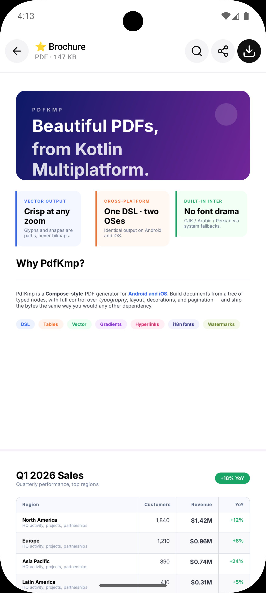
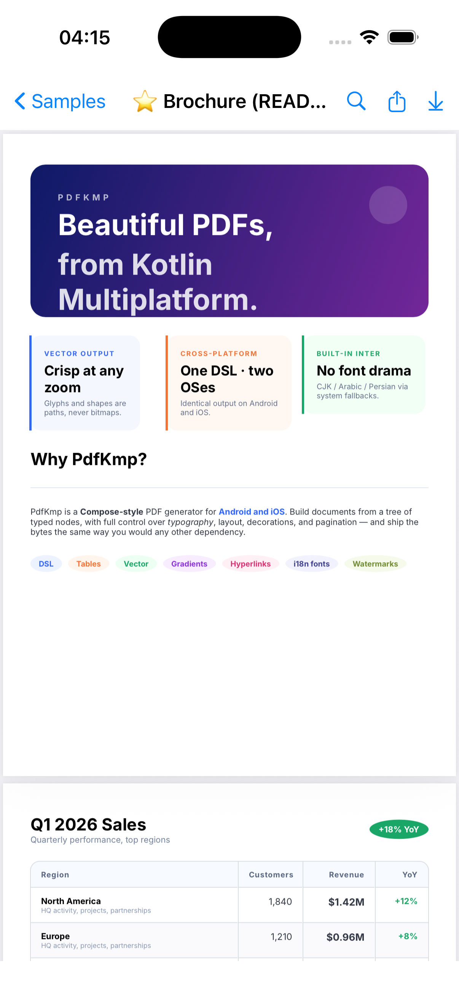
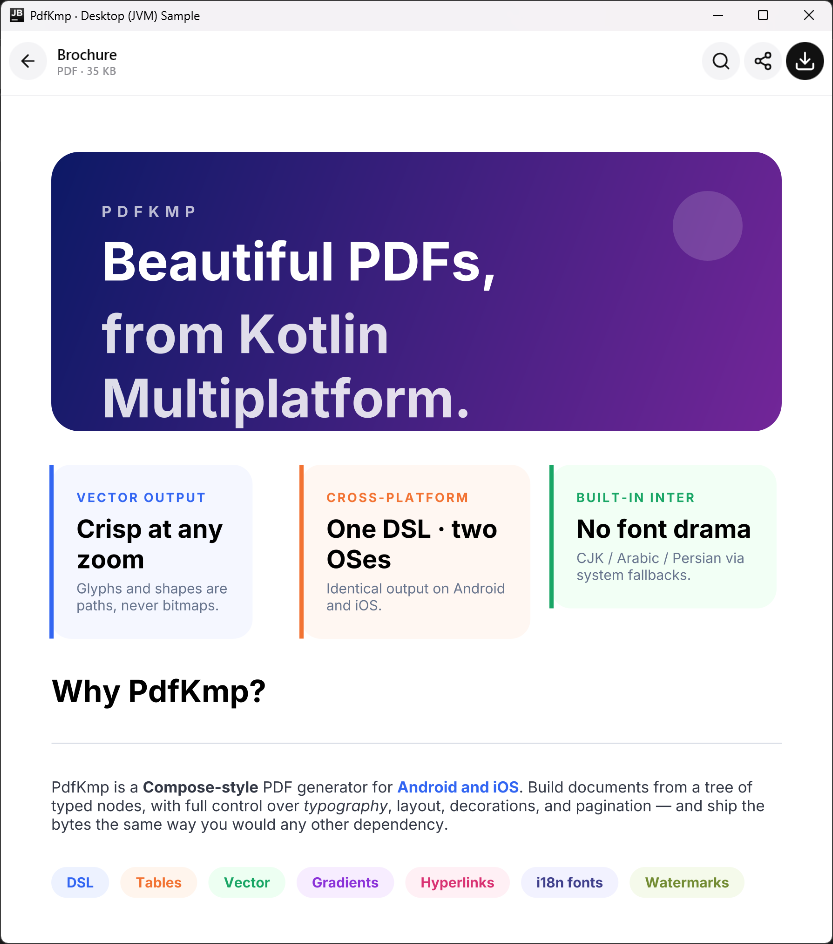

# PdfKmp

> Kotlin Multiplatform PDF generator for Android, iOS, Desktop (JVM) and Web (Wasm) — vector-first, type-safe, DSL-driven.

PdfKmp builds PDF documents from a Compose-style DSL that runs identically across
five surfaces: **Android, iOS, Desktop (macOS / Windows / Linux), the browser
(Kotlin/Wasm)**, plus an optional Compose Multiplatform **viewer**. Text becomes
glyph paths, shapes become path operators — every page stays sharp at any zoom
level, because nothing is rasterised.

The library ships the **Inter** font for cross-platform Latin parity and exposes
opt-in references to system CJK / Arabic / Persian fonts so non-Latin scripts
render natively on Android and iOS.

<div class="grid" markdown>

{ width="250" }
{ width="250" }
{ width="250" }

</div>

*The same `Samples.brochure()` document rendered on Android, iOS and Desktop — pixel-identical vector output.*

## Teaser

```kotlin
import com.conamobile.pdfkmp.pdf
import com.conamobile.pdfkmp.style.PdfColor
import com.conamobile.pdfkmp.unit.sp

val document = pdf {
    metadata { title = "Hello, PdfKmp" }
    page {
        text("Hello, world!") {
            fontSize = 24.sp
            bold = true
            color = PdfColor.Blue
        }
    }
}

val bytes: ByteArray = document.toByteArray()
```

## Feature highlights

- **Rich text engine** — full justification, `maxLines` + ellipsis, soft-hyphen + mid-word breaking, super/subscript spans, RTL with bidi reorder + Arabic shaping, orphan/widow control.
- **Layout & pagination** — column / row / box / card, weighted children, recursive column slicing, table row slicing with repeating headers, `keepTogether`, multi-column and uniform grid, mixed page orientations.
- **Tables, lists, dividers, circles & ellipses**, plus a free-form vector DSL (`freeDraw`).
- **Graphics** — QR codes, Code 128 barcodes, bar / line / pie / donut charts — all pure vector, no external dependencies.
- **Decorations** — backgrounds, per-corner radii, per-side borders, dashed / dotted borders, gradients, drop shadows, rotation, group opacity.
- **Navigation & document features** — bookmarks / outline, internal links + auto table of contents, hyperlinks, AcroForm fields, encryption, file attachments, best-effort PDF/A, and JVM digital signing.
- **Images & vectors** — PNG / JPEG / WebP / HEIF, Android `<vector>` and W3C `<svg>` (kept vector inside the PDF).
- **Companion modules** — a Compose Multiplatform [viewer](guides/viewer.md), a [Compose Resources](guides/compose-resources.md) bridge, and a [Markdown renderer](guides/markdown.md).

## Backends per platform

| Platform | Backend |
|---|---|
| Android | `android.graphics.pdf.PdfDocument` + `Canvas` |
| iOS | `UIGraphicsBeginPDFContextToData` + Core Graphics |
| Desktop (JVM) | Apache PDFBox — pure-Java, macOS / Windows / Linux |
| Web (Wasm) | `kmpwriter` — PdfKmp's own pure-Kotlin PDF 1.7 writer |

See [Platform parity](guides/platform-parity.md) for what each backend supports.

## Next steps

- [Getting started](getting-started.md) — install coordinates, hello-world, save & share.
- [Guides](guides/text.md) — feature-by-feature walkthroughs.
- [Samples](samples.md) — every bundled `Samples.*` document.
- [API Reference](https://conamobiledev.github.io/PdfKmp/api/) — generated Dokka KDoc.

---

PdfKmp is Apache 2.0 licensed and was authored end-to-end with [Claude Code](https://claude.com/claude-code).
